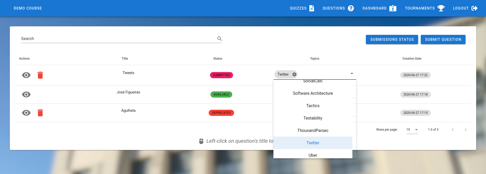
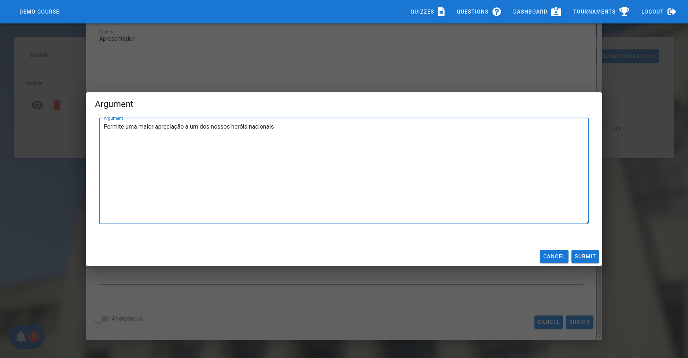
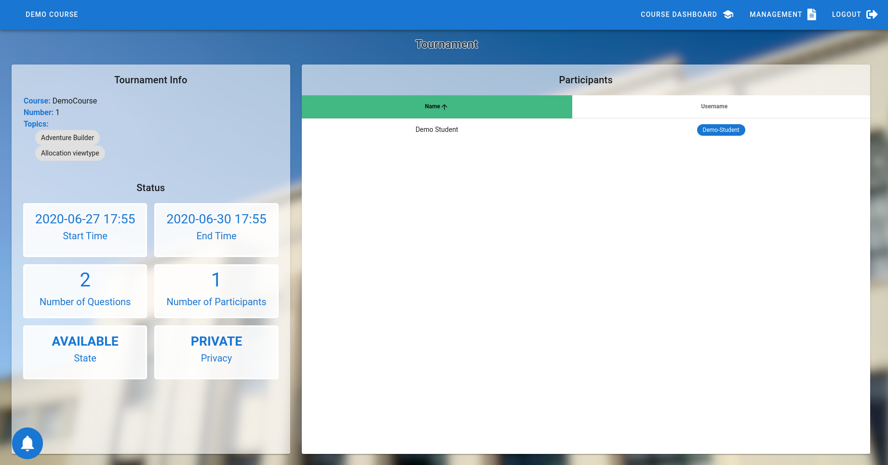
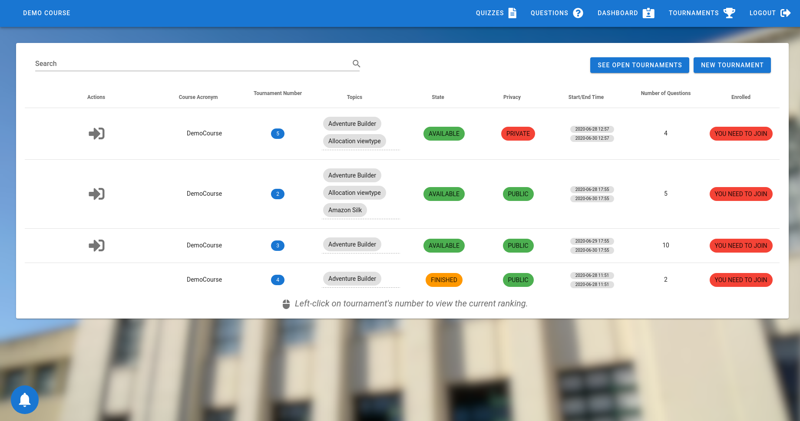

# Projeto NovaBase Grupo 18

## 1. Tabela de Conteúdos
- [Projeto NovaBase Grupo 18](#projeto-novabase-grupo-18)
  - [1. Tabela de Conteúdos](#1-tabela-de-conteúdos)
  - [2. Introdução](#2-introdução)
  - [3. Melhorias](#3-melhorias)
    - [3.1 Gerais](#31-gerais)
    - [3.2. Funcionalidades Já Existentes](#32-funcionalidades-já-existentes)
      - [1. Quizzes](#1-quizzes)
      - [2. Dashboard](#2-dashboard)
      - [3. Perguntas por Alunos (PpA)](#3-perguntas-por-alunos-ppa)
      - [4. Discussão de Perguntas (DdP)](#4-discussão-de-perguntas-ddp)
      - [5. Torneio de Perguntas (TdP)](#5-torneio-de-perguntas-tdp)
    - [3.3. Funcionalidades Novas](#33-funcionalidades-novas)
      - [1. Anúncios de Professores (AdP)](#1-anúncios-de-professores-adp)
      - [2. Sistema de Notificações (SdN)](#2-sistema-de-notificações-sdn)
  - [4. Deploy](#4-deploy)
    - [4.1. Escolha da Tecnologia](#41-escolha-da-tecnologia)
    - [4.2. Processo de Automatização](#42-processo-de-automatização)
  - [5. Considerações Finais](#5-considerações-finais)

## 2. Introdução

## 3. Melhorias

### 3.1 Gerais

[todo] - refresh, cookies, remember me, lembrar curso...

### 3.2. Funcionalidades Já Existentes

#### 1. Quizzes

-

#### 2. Dashboard

- ##### Docente pode ver dashboard de alunos
  - Extendendo a funcionalidade que implementámos que permite aos alunos ver a informação pública no dashboard de outros alunos,
agora os docentes também podem aceder a esses dashboards, clickando no username de um aluno. Em certos casos, aparecerá uma 
caixa de diálogo que serve como preview do dashboard, para evitar sair da página atual.

    Exemplos:

    ##### - Students View
    1 - Docente carrega no username de um aluno
      
    2 - Docente vê o dashboard do aluno
    

    ##### - Reviews View
    1 - Docente carrega no username de um aluno
      
    2 - Docente vê um preview do dashboard do aluno
    
    3 - Docente pode abrir o dashboard completo
    

    **NOTA:** Este comportamento acontece sempre que aparecer o username de um utilizador

#### 3. Perguntas por Alunos (PpA)

- ##### Aluno pode ver perguntas submetidas por outros alunos
  - Esta funcionalidade permite ao aluno ter uma ideia das submissões que já foram feitas e deste modo evitar uma possível
submissão repetida. Também permite ao aluno perceber o critério dos docentes no processo de review. Também é possivel filtrar
as submissões de modo a retirar as que foram feitas pelo próprio utilizador, ou pelo estado do review da submissão

  1 - Aluno acede à lista de todas as submissões do curso em execução
  

  2 - Aluno pode excluir as suas submissões da listagem
  

  3 - Aluno pode ver apenas as submissões aprovadas
  

  4 - Aluno pode ver apenas as submissões rejeitadas
  

- ##### Aluno pode selecionar tópicos da pergunta submetida
  - Agora é possivel adicionar também tópicos à pergunta submetida, que podem ser alterados pelo docente

  1 - Aluno escolhe tópicos a associar à pergunta (opcional)
  

  2 - Docente pode mudar tópicos associados à pergunta antes de dar review à submissão
  

  3 - Aluno pode ver os tópicos atuais da submissão
  

  **NOTA**: Docente pode continuar a editar os tópicos de uma pergunta aprovada no menu das perguntas

- ##### Aluno pode acrescentar um argumento à submissão que justifique a mesma
  - Extendido do teste prático, o aluno agora pode, de forma opcional, apresentar um breve argumento que justifique a sua submissão.

  1 - Antes da submissão ser enviada, aluno pode escolher se quer adicionar um argumento
  

  2 - Se não quiser, a submissão é enviada sem argumento

  3 - Se quiser, o aluno pode escrever o seu argumento
  

  4 - Docente pode ver o argumento (se existir) antes de escrever a justificação da sua decisão
  

#### 4. Discussão de Perguntas (DdP)

- Aluno/Docente pode editar as suas respostas/pedidos de esclarecimentos
  - Breve descrição

  - Caso de uso

- Aluno/Docente pode eliminar as suas respostas/pedidos de esclarecimentos
  - Breve descrição

  - Caso de uso

#### 5. Torneio de Perguntas (TdP)

- ##### Aluno que criou um torneio pode eliminá-lo
  - O aluno que criou o torneio pode agora eliminá-lo de forma permanente

    1 - Aluno acede à sua lista de torneios
    

    2 - Aluno elimina o torneio
    

    3 - O torneio é eliminado definitivamente
    

- ##### Docente tem acesso à informação dos torneios do curso em execução
  - O professor é agora capaz de visualizar os torneios criados pelos alunos

    1 - Professor acede à sua lista de torneios
    

    2 - Seleciona um torneio existente
    

    3 - Visualiza uma preview da dashboard de um aluno
    

    4 - Acede à dashboard de um aluno
    

- ##### Lista de Torneios Fechados
  - É possivel agora cada aluno consultar e obter informação sobre os torneios que já terminaram

    1 - Aluno acede à lista de torneios fechados
    

- ##### Ranking de participantes
  - É possivel agora cada aluno consultar o ranking de um determinado torneio, permitindo ver quem é o aluno com melhor classificação, sendo que o vencedor será o / os participantes com melhor nota aquando do fim do torneio

    1 - Aluno acede à lista de torneios existentes
    

    2 - Seleciona um torneio existente e observa a lista de participantes e os respetivos lugares
    

- ##### Torneio Privado
  - É possivel agora cada aluno decidir criar um torneio privado, que necessita de uma password para poder entrar

    1 - Aluno cria um torneio privado
    

    2 - Aluno tenta juntar-se a um torneio privado
    

### 3.3. Funcionalidades Novas

#### 1. Anúncios de Professores (AdP)

- Esta nova funcionalidade permite uma maior comunicação entre os docentes com os alunos que não existia ao introduzir um sistema de
anúncios em que docentes criam e alunos/outros docentes vêem na sua home page

- #### Docente pode criar anúncios
  - Docente pode criar um anúncio que será partilhado com todos os utilizadores do curso em execução

  1 - Docente carrega no botão para criar anúncio
  
  2 - Docente preenche campos para criar anúncio e guarda
  

- ##### Docente pode editar anúncios
  - Docente pode editar um anúncio criado, e caso um docente decida editar um anúncio existente, será indicado que o anúncio foi editado 

  1 - Docente carrega no ícone para editar anúncio
  
  2 - Docente edita o anúncio
  
  3 - Indicação de que anúncio foi editado é visivel
  

- ##### Docente pode eliminar anúncios
  - Docente pode remover um anúncio criado

  1 - Docente carrega no ícone para eliminar anúncio
  
  2 - Docente elimina o anúncio
  
  3 - Anúncio é eliminado definitivamente
  

- ##### Aluno/Docente podem ver anúncios do curso em execução na página principal
  - Os anúncios do curso em execução que se encontra selecionado sao visiveis na pagina principal, 
ou seja, assim que se faz login

  1 - Aluno/Docente abre página principal
  

#### 2. Sistema de Notificações (SdN)

- Breve descrição geral a justificar a criação desta funcionalidade (valor, etc...)

- Aluno/Docente recebe notificações
  - Breve descrição

  - Notificações possíveis (???)

  - Caso de uso

- Explicação das threads / serem assincronas

## 4. Deploy

### 4.1. Escolha da Tecnologia

[todo] - justificar porque é que escolhemos Azure

### 4.2. Processo de Automatização

[todo] - explicar resumidamente o processo de deploy do github até ao dominio

## 5. Considerações Finais

[todo] Gostámos muito, aprendemos muito, estamos muito orgulhosos, blah blah blah
