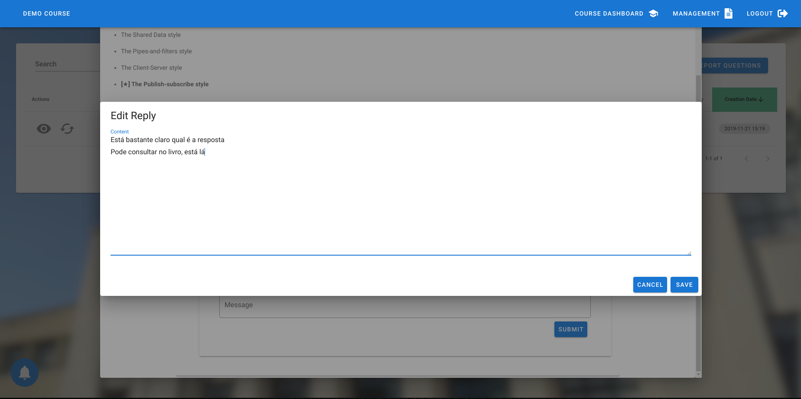
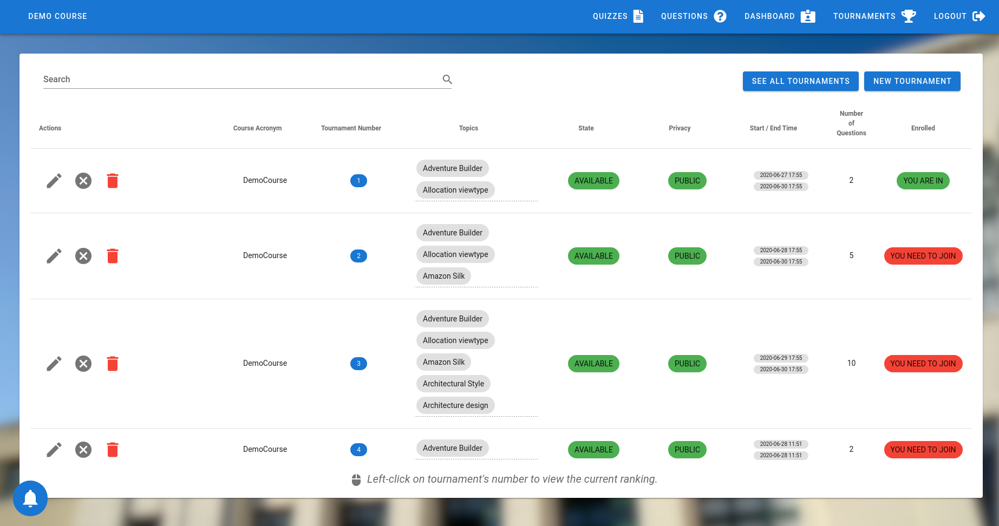
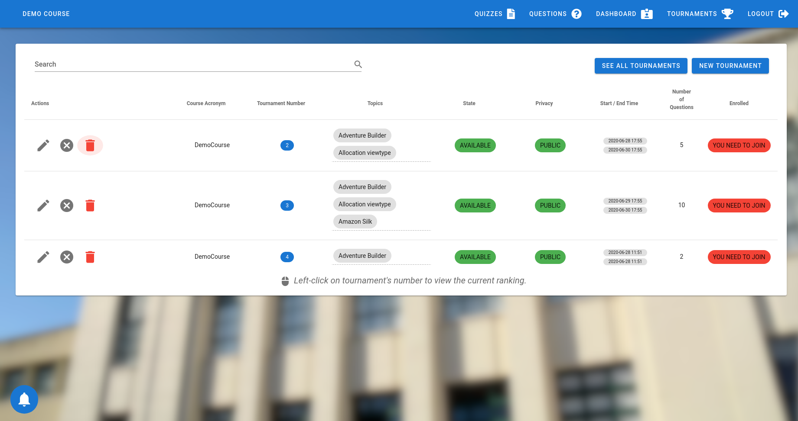
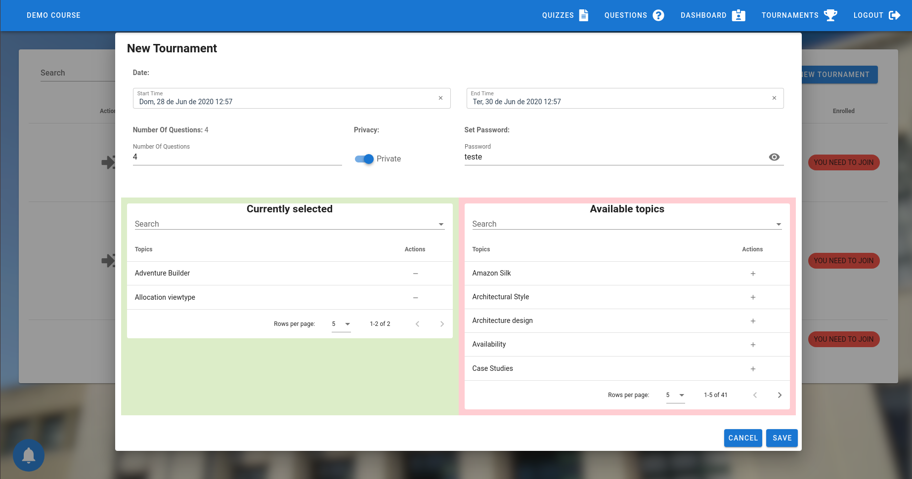
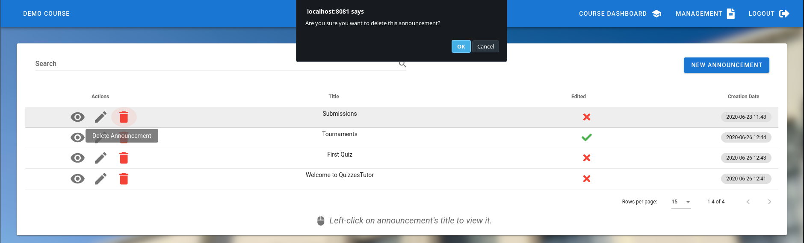
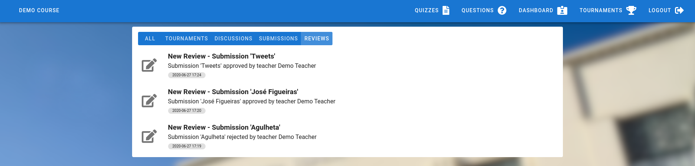
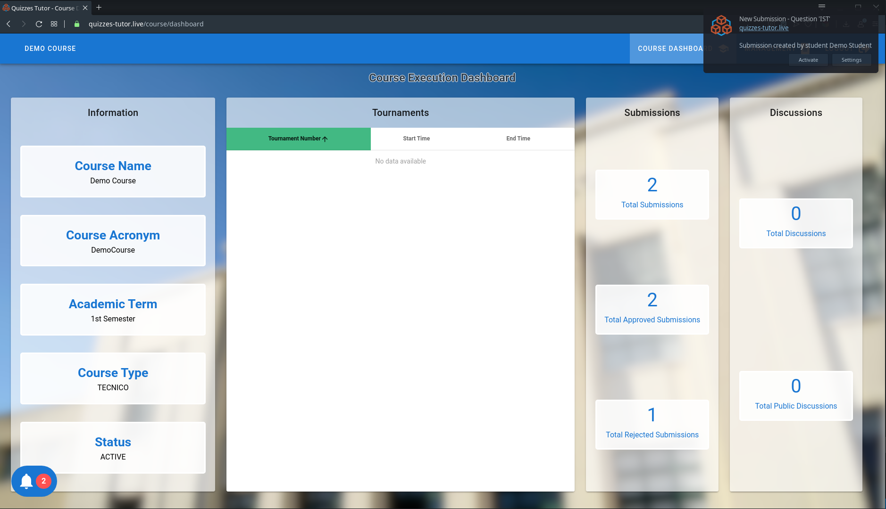

# Projeto NovaBase Grupo 18

## 1. Tabela de Conteúdos
  - [1. Tabela de Conteúdos](#1-tabela-de-conteúdos)
  - [2. Introdução](#2-introdução)
  - [3. Melhorias](#3-melhorias)
    - [3.1 Gerais](#31-gerais)
      - [1. Recarregar a página](#1-recarregar-a-página)
      - [2. Remember me](#2-remember-me)
      - [3. Cache da última cadeira acedida](#3-cache-da-última-cadeira-acedida)
      - [4. Reset ao Demo Course](#4-reset-ao-demo-course)
      - [5. Erro para página não encontrada](#5-erro-para-página-não-encontrada)
      - [6. Redirecionamento ao aceder à página de seleção de curso](#6-redirecionamento-ao-aceder-à-página-de-seleção-de-curso)
    - [3.2. Funcionalidades Já Existentes](#32-funcionalidades-já-existentes)
      - [1. Quizzes](#1-quizzes)
      - [2. Dashboard](#2-dashboard)
      - [3. Perguntas por Alunos (PpA)](#3-perguntas-por-alunos-ppa)
      - [4. Discussão de Perguntas (DdP)](#4-discussão-de-perguntas-ddp)
      - [5. Torneio de Perguntas (TdP)](#5-torneio-de-perguntas-tdp)
    - [3.3. Funcionalidades Novas](#33-funcionalidades-novas)
      - [1. Anúncios de Professores (AdP)](#1-anúncios-de-docentes-adp)
      - [2. Sistema de Notificações (SdN)](#2-sistema-de-notificações-sdn)
  - [4. Deploy](#4-deploy)
    - [4.1. Escolha da Plataforma](#41-escolha-da-plataforma)
    - [4.2. Processo de Automatização](#42-processo-de-automatização)
    - [4.3. Opções utilizadas]($43-opções-utilizadas)
  - [5. Considerações Finais](#5-considerações-finais)

## 2. Introdução

(Fizemos testes para tudo, cypress spock e jmeter, testámos bastante o nosso sistema, mas como é óbvio não é possível encontrar e corrigir todas as falhas, no entanto demos o nosso melhor...)

## 3. Melhorias

### 3.1 Gerais

#### 1. Recarregar a página

  Um problema que existia na versão original do Quizzes Tutor, era o facto de ao clicarmos na tecla F5 ou recarregarmos a página, sermos redirecionados para a página inicial e termos de fazer *login* outra vez. Conseguimos resolver este problema utilizando *Cookies* e, para tornar este mecanismo seguro, recorremos às seguintes *flags*:
  - `HttpOnly`, que desativa o acesso de Javascript à *Cookie* com informação sobre o utilizador, prevenindo ataques XSS;
  - `Secure`, que apenas permite que esta *Cookie* seja enviada através de ligações seguras (**HTTPS**), prevenindo ataques MITM;
  - `SameSite` definida para `Lax`, que impede que esta *Cookie* seja enviada em pedidos para outros sites, para prevenir ataques CSRF. Sendo que é uma funcionalidade relativamente recente, não é implementada por todos os *browsers*, mas cerca de 92% dos utilizadores estarão protegidos com esta, por isso decidimos arriscar, uma vez que os principais *browsers* todos suportam esta *flag*.

#### 2. Remember me

  Devido ao problema referido anteriormente, não era possível um utilizador guardar sessão no Quizzes Tutor, isto é, fechar o *browser*, e no dia seguinte voltar a utilizar a plataforma. Para corrigir isto, definimos que o utilizador pode escolher se quer ser relembrado ou não, isto é, se quer que a sua sessão seja guardada durante 1 dia (validade do JWT) ou se após fechar o *browser* quer que a sessão termine. Isto é implementado simplesmente colocando uma data de validade na *Cookie* com a identificação do utilizador.

#### 3. *Cache* da última cadeira acedida

  Como a probabilidade de um aluno estar sempre a utilizar o Quizzes Tutor para a mesma cadeira é bastante elevada, decidimos guardar (em *cache*) a última cadeira a que o utilizador acedeu para, assim que fizer *login*, ser logo redirecionado para esta.

#### 4. Reset ao Demo Course

  Na versão original, quando se tentava fazer *reset* ao `Demo Course`, ocorriam exceções devido à tentativa de eliminar questões que tinham respostas. Isso foi corrigido, e ainda eliminamos torneios, discussões, anúncios, submissões e reviews, tópicos e *assessments*.

#### 5. Erro para página não encontrada

  Anteriormente, quando tentávamos aceder a uma página que não existia, éramos redirecionados para a página inicial sem perceber muito bem o que tinha acontecido. Agora é mostrado um erro ao utilizador caso a página não exista mesmo, ou caso exista e este não tenha acesso a esta, por não estar *logado*, por exemplo, é apenas redirecionado para a página inicial.

#### 6. Redirecionamento ao aceder à página de seleção de curso

   Quando um utilizador estava apenas inscrito numa só cadeira, este era levado para a página de seleção de cadeiras para escolher, o que do nosso ponto de vista é apenas inútil e uma perda de tempo, por isso decidimos que não é necessário levá-lo à página para escolher a cadeira a que quer aceder, entrando diretamente, e ficando esta automaticamente guardada na *cache*.

### 3.2. Funcionalidades Já Existentes

#### 1. Quizzes

##### Quiz de QRCode

  Um problema que surgiu nas aulas, foi o facto de alguns alunos não conseguirem ler o código QR para aceder a este tipo de Quiz ou devido a problemas com o telemóvel ou por a câmera não conseguir captar o código com resolução suficiente. Para ninguém sair prejudicado, foi adicionado um código numérico por baixo do código QR, permitindo assim àqueles que estiverem com dificuldades em fazer *scan* ao QRCode, conseguirem aceder ao quiz através deste código, inserindo-o numa caixa de texto na mesma página em que é feito o *scan*.

  - Visão do docente

  

  - Visão do aluno
  

##### Quiz One-Way

  Na versão original, quando ocorria um erro a meio de um quiz, o utilizador era redirecionado para fora deste, e se o quiz fosse do tipo `One-Way`, não conseguiria voltar a entrar, sendo assim prejudicado. Para evitar isto, caso o utilizador seja "expulso" do quiz por causa de um erro, vai poder voltar ao quiz. No entanto, não vai poder alterar as respostas que já tiver dado e vai ter de avançar pergunta a pergunta até chegar a onde estava.

#### 2. Dashboard

- ##### Docente pode ver dashboard de alunos
  - Estendendo a funcionalidade que implementámos que permite aos alunos ver a informação pública no dashboard de outros alunos,
agora os docentes também podem aceder a esses dashboards, clicando no username de um aluno. Em certos casos, aparecerá uma
caixa de diálogo que serve como preview do dashboard, para evitar sair da página atual.

     
    Exemplos:

    ##### - Students View
    1 - Docente carrega no username de um aluno
    
    2 - Docente vê o dashboard do aluno
    
    ##### - Reviews View
    1 - Docente carrega no username de um aluno
    
    2 - Docente vê um preview do dashboard do aluno
    
    3 - Docente pode abrir o dashboard completo
    

    **NOTA:** As vistas apresentadas servem apenas de exemplo e não são totalmente representativas. Este comportamento acontece sempre que aparecer o username/nome de um utilizador e o cursor do rato mudar.

#### 3. Perguntas por Alunos (PpA)

- ##### Aluno pode ver perguntas submetidas por outros alunos
  - Esta funcionalidade permite ao aluno ter uma ideia das submissões que já foram feitas e deste modo evitar uma possível
submissão repetida. Também permite ao aluno perceber o critério dos docentes no processo de review. Também é possivel filtrar
as submissões de modo a retirar as que foram feitas pelo próprio utilizador, ou pelo estado do review da submissão

   

  1 - Aluno acede à lista de todas as submissões do curso em execução
  

  2 - Aluno pode excluir as suas submissões da listagem
  

  3 - Aluno pode ver apenas as submissões aprovadas
  

  4 - Aluno pode ver apenas as submissões rejeitadas
  

- ##### Aluno pode selecionar tópicos da pergunta submetida
  - Agora é possivel adicionar também tópicos à pergunta submetida, que podem ser alterados pelo docente

  1 - Aluno escolhe tópicos a associar à pergunta (opcional)
  

  2 - Docente pode mudar tópicos associados à pergunta antes de dar review à submissão
  

  3 - Aluno pode ver os tópicos atuais da submissão
  

  **NOTA**: Docente pode continuar a editar os tópicos de uma pergunta aprovada no menu das perguntas

- ##### Aluno pode acrescentar um argumento à submissão que justifique a mesma
  - Extendido do teste prático, o aluno agora pode, de forma opcional, apresentar um breve argumento que justifique a sua submissão.

   

  1 - Antes da submissão ser enviada, aluno pode escolher se quer adicionar um argumento
  

  2 - Se não quiser, a submissão é enviada sem argumento

  3 - Se quiser, o aluno pode escrever o seu argumento
  

  4 - Docente pode ver o argumento (se existir) antes de escrever a justificação da sua decisão
  

#### 4. Discussão de Perguntas (DdP)

- ##### Utilizador pode editar as suas respostas/discussões
  - Os utilizadores podem agora editar as suas respostas e as suas discussões, e os docentes podem alterar todas as discussões e todas as respostas.

   
  Exemplos:

  ##### - Aluno edita discussão
    1 - Aluno acede à lista de discussões
    

    2 - Aluno edita discussão
    

    3 - A discussão é alterada
    

  ##### - Docente edita resposta
    1 - Docente acede à resposta
    

    2 - Docente edita resposta
    

    3 - A resposta é alterada
    

- #### Utilizador pode eliminar as suas respostas/discussões
  - Os utilizadores podem também eliminar as suas respostas e as suas discussões, e os docentes podem remover tanto discussões como respostas, mesmo as que não foram submitadas por estes.

   
  Exemplos:

  ##### - Docente elimina discussão
    1 - Docente acede à discussão
    
    2 - Docente elimina a discussão
    
    3 - A discussão é eliminada
    

  ##### - Aluno elimina resposta
    1 - Aluno acede à resposta
    
    2 - Aluno elimina a resposta
    

#### 5. Torneio de Perguntas (TdP)

- ##### Aluno que criou um torneio pode eliminá-lo
  - O aluno que criou o torneio pode agora eliminá-lo de forma permanente

    1 - Aluno acede à sua lista de torneios
    

    2 - Aluno elimina o torneio
    

    3 - O torneio é eliminado definitivamente
    

- ##### Docente tem acesso à informação dos torneios do curso em execução
  - O docente é agora capaz de visualizar os torneios criados pelos alunos

    1 - Docente acede à sua lista de torneios
    

    2 - Seleciona um torneio existente
    

    3 - Visualiza uma preview da dashboard de um aluno
    

    4 - Acede à dashboard de um aluno
    

- ##### Lista de Torneios Fechados
  - É possivel agora cada aluno consultar e obter informação sobre os torneios que já terminaram

    1 - Aluno acede à lista de torneios fechados
    

- ##### Ranking de participantes
  - É possivel agora cada aluno consultar o ranking de um determinado torneio, permitindo ver quem é o aluno com melhor classificação, sendo que o vencedor será o / os participantes com melhor nota aquando do fim do torneio

    1 - Aluno acede à lista de torneios existentes
    

    2 - Seleciona um torneio existente e observa a lista de participantes e os respetivos lugares
    

- ##### Torneio Privado
  - É possivel agora cada aluno decidir criar um torneio privado, que necessita de uma password para poder entrar

    1 - Aluno cria um torneio privado
    

    2 - Aluno escolhe juntar-se a um torneio privado
    

    3 - Necessita de password para conseguir juntar-se
    

### 3.3. Funcionalidades Novas

#### 1. Anúncios de Professores (AdP)

- Esta nova funcionalidade permite uma maior comunicação entre os docentes com os alunos que não existia ao introduzir um sistema de
anúncios em que docentes criam e alunos/outros docentes vêem na sua home page

- #### Docente pode criar anúncios
  - Docente pode criar um anúncio que será partilhado com todos os utilizadores do curso em execução

  1 - Docente carrega no botão para criar anúncio
  
  2 - Docente preenche campos para criar anúncio e guarda
  

- ##### Docente pode editar anúncios
  - Docente pode editar um anúncio criado, e caso um docente decida editar um anúncio existente, será indicado que o anúncio foi editado

  1 - Docente carrega no ícone para editar anúncio
  
  2 - Docente edita o anúncio
  
  3 - Indicação de que anúncio foi editado é visivel
  

- ##### Docente pode eliminar anúncios
  - Docente pode remover um anúncio criado

  1 - Docente carrega no ícone para eliminar anúncio
  
  2 - Docente elimina o anúncio
  
  3 - Anúncio é eliminado definitivamente
  

- ##### Aluno/Docente podem ver anúncios do curso em execução na página principal
  - Os anúncios do curso em execução que se encontra selecionado sao visiveis na pagina principal,
ou seja, assim que se faz *login*

  1 - Aluno/Docente abre página principal
  

#### 2. Sistema de Notificações (SdN)

- Esta nova funcionalidade permite receber em tempo real uma notificação cujo objetivo é alertar o utilizador de uma mudança no estado do sistema. Esta funcionalidade tem inúmeras vantagens, e permite ao utilizador uma maior facilidade de utilização.

- Está disponivel para alunos e docentes

- Foi introduzido um botão que está sempre visivel ao aluno/docente, excepto durante a execução de um quiz.

- ##### Aluno/Docente recebe notificações
  - Quando o utilizador recebe uma notificação, poderá ver as notificações mais recentes no *dropdown* disponivel no botão de notificações, realçando as notificações ainda não lidas.

  - Utilizador também pode optar por ver todas as notificações já recebidas, podendo filtrá-las por tipo

  - **Notificações possíveis**

    - Aluno

      - Torneio (recebidas por todos os participantes de um torneio aberto)

        - Tempo de inicio/fim editados
        - Número de questões editado
        - Tópicos editados
        - Torneio cancelado

      - Discussões (recebidas pelo aluno acerca das suas discussões)

        -  Discussão tornada pública/privada por docente
        -  Nova resposta à discussão
        -  Resposta a discussâo editada
        -  Resposta a discussão eliminada

      - Submissões (recebidas pelo aluno acerca das suas submissões)

        - Submissão aprovada/rejeitada por docente
        - Submissão eliminada por docente

    - Docente

      - Discussões (recebidas pelo docente acerca de discussões realizadas no curso em execução)

        - Discussão criada por aluno
        - Discussão editada por aluno
        - Discussão eliminada por aluno
        - Resposta a discussão criada
        - Resposta a discussão editada
        - Resposta a discussão eliminada

      - Submissões (recebidas pelo docente acerca de submissões realizada no curso em execução)

        - Submissão criada por aluno

  - **Demonstração**

    - Botão de notificações

      1 - Após receber uma notificação, o número de notificações não lidas aumenta no botão de notificações
      
      2 - É disposta a lista de notificações, com ênfase nas notificações não lidas
      
      3 - Qunado não existem notificações não lidas, lista é apresentada normalmente
      

    - Lista de Notificações

      1 - Aluno/Docente pode ver todas as notificações recebidas
      
      2 - Notificações podem ser filtradas por tipo
      
      
      
      

    - Notificações

    [todo] falar de api e da notificaçao em si

    

##### - Uso de *threads*

  Como a operação de notificação de vários utilizadores é dispendiosa e pode demorar bastante tempo, decidimos que a chamada à função para realizar esta operação deveria ser realizada numa *thread* diferente para as operações que geram notificações não ficarem muito tempo bloqueadas nesta operação, dando assim uma experiência de utilização mais agradável. Desta forma, por exemplo, o aluno poderá criar uma submissão e não notar que algo mais está a acontecer, porque o tempo para realizar esta ação é apenas o tempo que levaria caso não realizasse a notificação de utilizadores.

  A nossa implementação passou por definir uma *Thread Pool* com limites diferentes do *default*, para não sobrecarregarmos a máquina com demasiado processamento paralelo, mas ao mesmo tempo não acumular demasiado processamento, levando à perda de possíveis *threads*. Assim, permitimos que 3 *threads* executem paralelamente, e que 20 outras possam esperar numa fila. Caso este limite seja atingido (isto é, 3 *threads* a executar e mais 20 em espera), permitimos que se ponham em execução mais 7 *threads*, totalizando 10 *threads* em execução e 20 em espera.

##### - Notificações em tempo real

  O comportamento descrito anteriormente apenas permitia que o utilizador recebesse notificações fazendo uma chamada ao *backend*, mas isto não é ideal, porque o utilizador pode perder notificações importantes. Para resolver este problema, recorremos a duas APIs em conjunto com *Service Workers*: Notifications API e Push API.

  A primeira permite mostrar notificações independentemente do *browser* utilizado, fornecendo uma interface *standard*.

  A segunda permite reagir a eventos de `push`, colocando um "servidor" do lado do cliente, com um *endpoint* único, para receber mensagens, despoletando o evento mencionado. No nosso caso, o *backend* envia a notificação para cada um destes *endpoints*, e por ser uma operação ainda mais dispendiosa que a anterior, por envolver cifrar dados e fazer pedidos através da rede, recorremos novamente às *Thread Pools*, no entanto, modificámos os limites, permitindo assim que estejam 5 *threads* ativas, 40 em espera e caso seja criada mais alguma após estes limites serem alcaçados, permitimos que no máximo estejam 20 threads ativas. O único possível problema desta API é o facto de não ser suportada pela Apple (e pelo Internet Explorer também), pelo que os utilizadores do Safari não poderão usufruir deste recurso, mas poderão ter na mesma as notificações através de chamadas ao backend.

  Assim, esta grande funcionalidade poderá ser utilizada por cerca de 77% dos utilizadores.

## 4. Deploy

### 4.1. Escolha da Plataforma

  Para a plataforma de *deploy*, escolhemos a Azure, porque tem preços bastante acessíveis, integração direta com o GitHub, o que facilita a interação com a própria plataforma; configuração dos Azure Pipelines através de YAML (linguagem também usada pelo GitHub para configurar as GitHub Actions) e também porque oferece um serviço de boa qualidade, sendo atualmente uma das melhores na área.

  Escolhemos fazer *deploy* diretamente numa VM, porque apesar de termos de instalar por nós as dependências necessárias, permite-nos ter mais controlo sobre o sistema e uma performance ligeiramente melhor do que se usássemos o Docker dentro desta, e permite-nos fazer *deploy* mais rapidamente.

  Para servir o *frontend* do nosso Quizzes Tutor temos o `nginx` que permite gerir certificados de forma fácil, e para monitorizarmos o *backend*, utilizámos uma sessão de `tmux` que permite facilmente iniciar ou parar este servidor, tanto através dos comandos normais fornecidos por este, como por um *systemd service* e alguns *scripts* criados por nós. Para gerir os nossos ceriticados SSL, utilizámos o `Certbot` da `Let's Encrypt` que vai renovando automaticamente os certificados após ficarem inválidos.

### 4.2. Processo de Automatização

  Para fazermos *deploy* na nossa VM, escolhemos os Azure Pipelines, configurando todo o processo através de *scripts* e do ficheiro `azure-pipelines.yml`.

  Neste processo, temos as seguintes etapas:
    - Fazer *checkout* do repositório para o *agent* (VM onde está a correr o *pipeline*)
    - Testar a *cache* de dependências do *backend*
    - Caso as dependências não estejam em *cache*, instalá-las e guardar na *cache* para a próxima vez que o *pipeline* for executado não demorar tanto tempo.
    - Compilar o *backend* para um ficheiro `.jar`
    - Testar a *cache* de dependências do *frontend*
    - Caso estas não estejam guardadas na *cache*, instalá-las e guardá-las na *cache* pela mesma razão acima
    - Compilar o *frontend* e criar um ficheiro `.zip` com os ficheiros gerados por esta etapa
    - Colocar o ficheiros ficheiros `.jar` e `.zip` no `Artifact Staging Directory` para enviar para a nossa VM
    - Neste momento, a computação neste *agent* termina e passa a realizar-se na nossa VM, que tivemos de associar ao *pipeline* através do registo desta num *Environment*
    - Já na VM, retirar os ficheiros do `Artifact Staging Directory` para a VM
    - Parar o *backend*
    - Fazer *backup* das versões antigas tanto do *frontend* como do *backend*
    - Fazer *unzip* ao *frontend* para a pasta "controlada" pelo `nginx`
    - Colocar o *backend* em funcionamento
    - Caso a operação anterior falhe, as novas versões são eliminadas e as anteriores são colocadas em funcionamento

### 4.3. Opções utilizadas

  Decidimos apostar na segurança e na eficiência, por isso decidimos utilizar o protocolo **HTTPS** para estabelecer um canal seguro entre cliente e servidor, e visto que existe um grande suporte do *browsers* ao protocolo **HTTP/2**, decidimos recorrer a este, uma vez que necessita de TLS para ser executado, e nós já tínhamos configurado para o protocolo **HTTPS**. Utilizando **HTTP/2**, os dados são comprimidos e não existe o problema do bloqueio *Head of Line*, tornando a transmissão mais rápida. Como é implementado por quase todos os *browsers*, cerca de 96% dos nossos utilizadore poderão ter esta melhoria de velocidade.

  Para prevenir a mudança de protocolo para HTTP, definimos o *header* HSTS, impedindo assim que ataques de *downgrade* de protocolo e consequente sequestro de *Cookies* ocorram.

## 5. Considerações Finais

  Em nome de toda a equipa gostariamos de agradecer aos docentes da cadeira de Engenharia de Software, bem como à NovaBase, pela oportunidade de participar neste projeto. Durante o semestre, e em particular neste último mês de desenvolvimento, aprendemos bastante sobre como trabalhar em equipa e sobre as tecnologias utilizadas, bem como a sua relevância no contexto profissional atual. Estamos extremamente orgulhosos do trabalho realizado, e acreditamos que o valor do produto tenha sido elevado. Foi um trabalho realizado em equipa que seguiu sempre a metodologia ensinada nesta UC.

  Em nome de todo o grupo 18, um grande obrigado, e esperemos que gostem do nosso trabalho.

**NOTA:** Os dados estatísticos apresentados foram retirados do site https://caniuse.com, que mostra que *browsers* suportam determinadas funcionalidades, assim como a percentagem de utilizadores que podem possivelmente usufruir destas.
