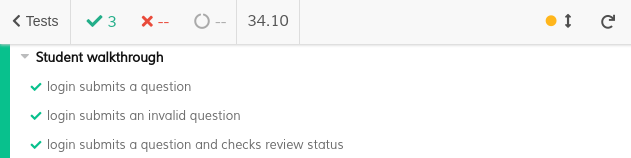
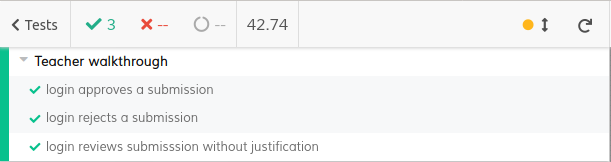
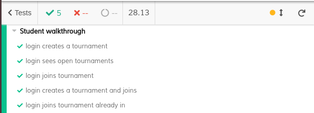

# ES20 P3 submission, Group 18

## Feature PPA

### Subgroup

 - Daniel Serafim, ist189428, dserafim1999
   + Issues assigned: [#117](https://github.com/tecnico-softeng/es20al_18-project/issues/117), [#119](https://github.com/tecnico-softeng/es20al_18-project/issues/119), [#120](https://github.com/tecnico-softeng/es20al_18-project/issues/120), [#121](https://github.com/tecnico-softeng/es20al_18-project/issues/121), [#124](https://github.com/tecnico-softeng/es20al_18-project/issues/124), [#125](https://github.com/tecnico-softeng/es20al_18-project/issues/125), [#142](https://github.com/tecnico-softeng/es20al_18-project/issues/142), [#144](https://github.com/tecnico-softeng/es20al_18-project/issues/144), [#157](https://github.com/tecnico-softeng/es20al_18-project/issues/157), [#159](https://github.com/tecnico-softeng/es20al_18-project/issues/159)
 - Tomás Inácio, ist189553, tomas1999set
   + Issues assigned: [#118](https://github.com/tecnico-softeng/es20al_18-project/issues/118), [#122](https://github.com/tecnico-softeng/es20al_18-project/issues/122), [#123](https://github.com/tecnico-softeng/es20al_18-project/issues/123), [#143](https://github.com/tecnico-softeng/es20al_18-project/issues/143), [#158](https://github.com/tecnico-softeng/es20al_18-project/issues/158)
 
### Pull requests associated with this feature

The list of pull requests associated with this feature is:

 - [PR #139](https://github.com/tecnico-softeng/es20al_18-project/pull/139)
 - [PR #154](https://github.com/tecnico-softeng/es20al_18-project/pull/154)
 - [PR #160](https://github.com/tecnico-softeng/es20al_18-project/pull/160)
 - [PR #167](https://github.com/tecnico-softeng/es20al_18-project/pull/167)

### Frontend

#### New/Updated Views

 - [SubmissionView](https://github.com/tecnico-softeng/es20al_18-project/blob/829bd59f8ca09eebb659cc1e2bbf85ca89bc1832/frontend/src/views/student/questions/SubmissionView.vue)
   + [EditSubmissionDialog](https://github.com/tecnico-softeng/es20al_18-project/blob/829bd59f8ca09eebb659cc1e2bbf85ca89bc1832/frontend/src/views/student/questions/EditSubmissionDialog.vue)
   + [ShowReviewDialog](https://github.com/tecnico-softeng/es20al_18-project/blob/829bd59f8ca09eebb659cc1e2bbf85ca89bc1832/frontend/src/views/student/questions/ShowReviewDialog.vue)
 - [ReviewsView](https://github.com/tecnico-softeng/es20al_18-project/blob/829bd59f8ca09eebb659cc1e2bbf85ca89bc1832/frontend/src/views/teacher/reviews/ReviewsView.vue)
   + [EditReview](https://github.com/tecnico-softeng/es20al_18-project/blob/829bd59f8ca09eebb659cc1e2bbf85ca89bc1832/frontend/src/views/teacher/reviews/EditReview.vue)
 - [StudentReviewsView](https://github.com/tecnico-softeng/es20al_18-project/blob/829bd59f8ca09eebb659cc1e2bbf85ca89bc1832/frontend/src/views/student/questions/StudentReviewsView.vue)
   + [ShowReview](https://github.com/tecnico-softeng/es20al_18-project/blob/829bd59f8ca09eebb659cc1e2bbf85ca89bc1832/frontend/src/views/student/questions/ShowReview.vue)

#### New/Updated Models

 - [Submission](https://github.com/tecnico-softeng/es20al_18-project/blob/829bd59f8ca09eebb659cc1e2bbf85ca89bc1832/frontend/src/models/management/Submission.ts)
 - [Review](https://github.com/tecnico-softeng/es20al_18-project/blob/829bd59f8ca09eebb659cc1e2bbf85ca89bc1832/frontend/src/models/management/Review.ts)

### Additional services implemented

 - [getSubmissionReviews](https://github.com/tecnico-softeng/es20al_18-project/blob/829bd59f8ca09eebb659cc1e2bbf85ca89bc1832/backend/src/main/java/pt/ulisboa/tecnico/socialsoftware/tutor/submission/SubmissionService.java#L109)
    + [getSubmissionReviews](https://github.com/tecnico-softeng/es20al_18-project/blob/829bd59f8ca09eebb659cc1e2bbf85ca89bc1832/backend/src/main/java/pt/ulisboa/tecnico/socialsoftware/tutor/submission/SubmissionController.java#L99)
    + [Spock tests](https://github.com/tecnico-softeng/es20al_18-project/blob/829bd59f8ca09eebb659cc1e2bbf85ca89bc1832/backend/src/test/groovy/pt/ulisboa/tecnico/socialsoftware/tutor/submission/service/GetSubmissionReviewsTest.groovy)
    + [Feature test (JMeter)](https://github.com/tecnico-softeng/es20al_18-project/blob/829bd59f8ca09eebb659cc1e2bbf85ca89bc1832/backend/jmeter/submission/WSGetSubmissionReviewsTest.jmx)

 - [getSubsToTeacher](https://github.com/tecnico-softeng/es20al_18-project/blob/829bd59f8ca09eebb659cc1e2bbf85ca89bc1832/backend/src/main/java/pt/ulisboa/tecnico/socialsoftware/tutor/submission/SubmissionService.java#L120)
    + [getSubsToTeacher](https://github.com/tecnico-softeng/es20al_18-project/blob/829bd59f8ca09eebb659cc1e2bbf85ca89bc1832/backend/src/main/java/pt/ulisboa/tecnico/socialsoftware/tutor/submission/SubmissionController.java#L63)
    + [Spock tests](https://github.com/tecnico-softeng/es20al_18-project/blob/829bd59f8ca09eebb659cc1e2bbf85ca89bc1832/backend/src/test/groovy/pt/ulisboa/tecnico/socialsoftware/tutor/submission/service/GetSubmissionsToTeacherTest.groovy)
    + [Feature test (JMeter)](https://github.com/tecnico-softeng/es20al_18-project/blob/829bd59f8ca09eebb659cc1e2bbf85ca89bc1832/backend/jmeter/submission/WSGetSubmissionsToTeacherTest.jmx)
 
 - [getReviewsToTeacher](https://github.com/tecnico-softeng/es20al_18-project/blob/829bd59f8ca09eebb659cc1e2bbf85ca89bc1832/backend/src/main/java/pt/ulisboa/tecnico/socialsoftware/tutor/submission/SubmissionService.java#L129)
    + [getReviewsToTeacher](https://github.com/tecnico-softeng/es20al_18-project/blob/829bd59f8ca09eebb659cc1e2bbf85ca89bc1832/backend/src/main/java/pt/ulisboa/tecnico/socialsoftware/tutor/submission/SubmissionController.java#L75)
    + [Spock tests](https://github.com/tecnico-softeng/es20al_18-project/blob/829bd59f8ca09eebb659cc1e2bbf85ca89bc1832/backend/src/test/groovy/pt/ulisboa/tecnico/socialsoftware/tutor/submission/service/GetReviewsToTeacherTest.groovy)
    + [Feature test (JMeter)](https://github.com/tecnico-softeng/es20al_18-project/blob/829bd59f8ca09eebb659cc1e2bbf85ca89bc1832/backend/jmeter/submission/WSGetReviewsToTeacherTest.jmx)

 - [getSubmissions](https://github.com/tecnico-softeng/es20al_18-project/blob/829bd59f8ca09eebb659cc1e2bbf85ca89bc1832/backend/src/main/java/pt/ulisboa/tecnico/socialsoftware/tutor/submission/SubmissionService.java#L138)
    + [getSubmissions](https://github.com/tecnico-softeng/es20al_18-project/blob/829bd59f8ca09eebb659cc1e2bbf85ca89bc1832/backend/src/main/java/pt/ulisboa/tecnico/socialsoftware/tutor/submission/SubmissionController.java#L110)
    + [Spock tests](https://github.com/tecnico-softeng/es20al_18-project/blob/829bd59f8ca09eebb659cc1e2bbf85ca89bc1832/backend/src/test/groovy/pt/ulisboa/tecnico/socialsoftware/tutor/submission/service/GetSubmissionsTest.groovy)
    + [Feature test (JMeter)](https://github.com/tecnico-softeng/es20al_18-project/blob/829bd59f8ca09eebb659cc1e2bbf85ca89bc1832/backend/jmeter/submission/WSGetSubmissionsTest.jmx)

### End-to-end tests

#### Created tests

 - [Login submits a question](https://github.com/tecnico-softeng/es20al_18-project/blob/829bd59f8ca09eebb659cc1e2bbf85ca89bc1832/frontend/tests/e2e/specs/student/submitQuestions.js#L10)
 - [Login submits an invalid question](https://github.com/tecnico-softeng/es20al_18-project/blob/829bd59f8ca09eebb659cc1e2bbf85ca89bc1832/frontend/tests/e2e/specs/student/submitQuestions.js#L17)
 - [Login submits a question and checks review status](https://github.com/tecnico-softeng/es20al_18-project/blob/829bd59f8ca09eebb659cc1e2bbf85ca89bc1832/frontend/tests/e2e/specs/student/submitQuestions.js#L28)
 - [Login approves a submission](https://github.com/tecnico-softeng/es20al_18-project/blob/829bd59f8ca09eebb659cc1e2bbf85ca89bc1832/frontend/tests/e2e/specs/teacher/reviewSubmissions.js#13)
- [Login rejects a submission](https://github.com/tecnico-softeng/es20al_18-project/blob/829bd59f8ca09eebb659cc1e2bbf85ca89bc1832/frontend/tests/e2e/specs/teacher/reviewSubmissions.js#122)
- [Login rejects a submission without justification](https://github.com/tecnico-softeng/es20al_18-project/blob/829bd59f8ca09eebb659cc1e2bbf85ca89bc1832/frontend/tests/e2e/specs/teacher/reviewSubmissions.js#129)
  
#### Rationale
We separated our test cases based on who is accessing the system, to be as faithful to a real user experience as possible.
In the student's case, three possible interactions are tested, and are what we believe to be the most common uses for this feature. Those include
submitting a question, making a mistake submitting a question (in this case, not enough information to create a question) and submitting a question,
followed by checking the submission's status (which has been reviewed by a teacher externally).
In the teacher's case, a student submission is both accepted and rejected, and the teacher also incorrectly reviews a submission (with no justification). These are the main cases that will occur when a teacher intends to review a submission.

#### Commands defined

 - [demoStudentLogin](https://github.com/tecnico-softeng/es20al_18-project/blob/829bd59f8ca09eebb659cc1e2bbf85ca89bc1832/frontend/tests/e2e/support/commands.js#L34)
 - [openSubmissions](https://github.com/tecnico-softeng/es20al_18-project/blob/829bd59f8ca09eebb659cc1e2bbf85ca89bc1832/frontend/tests/e2e/support/commands.js#L45)
 - [submitQuestion](https://github.com/tecnico-softeng/es20al_18-project/blob/829bd59f8ca09eebb659cc1e2bbf85ca89bc1832/frontend/tests/e2e/support/commands.js#L53)
 - [viewQuestion](https://github.com/tecnico-softeng/es20al_18-project/blob/829bd59f8ca09eebb659cc1e2bbf85ca89bc1832/frontend/tests/e2e/support/commands.js#L75)
 - [submitInvalidQuestion](https://github.com/tecnico-softeng/es20al_18-project/blob/829bd59f8ca09eebb659cc1e2bbf85ca89bc1832/frontend/tests/e2e/support/commands.js#L89)
 - [deleteSubmission](https://github.com/tecnico-softeng/es20al_18-project/blob/829bd59f8ca09eebb659cc1e2bbf85ca89bc1832/frontend/tests/e2e/support/commands.js#L97)
 - [teacherReviewsSubmission](https://github.com/tecnico-softeng/es20al_18-project/blob/829bd59f8ca09eebb659cc1e2bbf85ca89bc1832/frontend/tests/e2e/support/commands.js#L107)
- [ApproveSubmissions](https://github.com/tecnico-softeng/es20al_18-project/blob/829bd59f8ca09eebb659cc1e2bbf85ca89bc1832/frontend/tests/e2e/support/commands.js#L119)
- [RejectSubmissions](https://github.com/tecnico-softeng/es20al_18-project/blob/829bd59f8ca09eebb659cc1e2bbf85ca89bc1832/frontend/tests/e2e/support/commands.js#L133)
- [TeacherDeleteSubmission](https://github.com/tecnico-softeng/es20al_18-project/blob/829bd59f8ca09eebb659cc1e2bbf85ca89bc1832/frontend/tests/e2e/support/commands.js#L147)
- [getSubmissionStatus](https://github.com/tecnico-softeng/es20al_18-project/blob/829bd59f8ca09eebb659cc1e2bbf85ca89bc1832/frontend/tests/e2e/support/commands.js#L157)
  
#### Screenshot of test results overview

---

## Feature DDP

### Subgroup

 - Nome, istID, githubID
   + Issues assigned: [#1](https://github.com), [#3](https://github.com)
 - Nome, istID, githubID
   + Issues assigned: [#2](https://github.com), [#4](https://github.com)
 
### Pull requests associated with this feature

The list of pull requests associated with this feature is:

 - [PR #000](https://github.com)
 - [PR #001](https://github.com)
 - [PR #002](https://github.com)

### Frontend

#### New/Updated Views

 - [View0](https://github.com)
 - [View1](https://github.com)

#### New/Updated Models

 - [Model0](https://github.com)
 - [Model1](https://github.com)

### Additional services implemented

 - [Service 0](https://github.com)
    + [Controller](https://github.com)
    + [Spock tests](https://github.com)
    + [Feature test (JMeter)](https://github.com)

 - [Service 1](https://github.com)
    + [Controller](https://github.com)
    + [Spock tests](https://github.com)
    + [Feature test (JMeter)](https://github.com)

### End-to-end tests

#### Created tests

 - [Login creates and deletes a course execution](https://github.com/socialsoftware/quizzes-tutor/blob/6dcf668498be3d6e45c84ebf61e81b931bdc797b/frontend/tests/e2e/specs/admin/manageCourseExecutions.js#L10)
 - [Login creates two course executions and deletes it](https://github.com/socialsoftware/quizzes-tutor/blob/6dcf668498be3d6e45c84ebf61e81b931bdc797b/frontend/tests/e2e/specs/admin/manageCourseExecutions.js#L16)
 - [Login creates FROM a course execution and deletes it](https://github.com/socialsoftware/quizzes-tutor/blob/6dcf668498be3d6e45c84ebf61e81b931bdc797b/frontend/tests/e2e/specs/admin/manageCourseExecutions.js#L30)

#### Rationale
*TODO*: describe in 100 words (max) the relevance of the end-to-end tests defined with respect to the
common use cases.

#### Commands defined

 - [commands.js](https://github.com/socialsoftware/quizzes-tutor/blob/master/frontend/tests/e2e/support/commands.js)

#### Screenshot of test results overview

---

## Feature TDP

### Subgroup
 - João Dinis, ist189485, JDinis99
   + Issues assigned: [#113](https://github.com/tecnico-softeng/es20al_18-project/issues/113), [#136](https://github.com/tecnico-softeng/es20al_18-project/issues/136), [#137](https://github.com/tecnico-softeng/es20al_18-project/issues/137), [#138](https://github.com/tecnico-softeng/es20al_18-project/issues/138)
 - Tiago Fonseca, ist189542, TiagoFonseca99
   + Issues assigned: [#115](https://github.com/tecnico-softeng/es20al_18-project/issues/115), [#116](https://github.com/tecnico-softeng/es20al_18-project/issues/116), [#151](https://github.com/tecnico-softeng/es20al_18-project/issues/151), [#163](https://github.com/tecnico-softeng/es20al_18-project/issues/163), [#164](https://github.com/tecnico-softeng/es20al_18-project/issues/164)

### Pull requests associated with this feature

The list of pull requests associated with this feature is:

 - [PR #146](https://github.com/tecnico-softeng/es20al_18-project/pull/146)
 - [PR #155](https://github.com/tecnico-softeng/es20al_18-project/pull/155)
 - [PR #165](https://github.com/tecnico-softeng/es20al_18-project/pull/165)

### Frontend

#### New/Updated Views

 - [AllTournamentView](https://github.com/tecnico-softeng/es20al_18-project/tree/0341cbb16b8ed157d365f8b105e47d7e7afa5059/frontend/src/views/student/tournament/AllTournamentView.vue)
 - [OpenTournamentView](https://github.com/tecnico-softeng/es20al_18-project/tree/0341cbb16b8ed157d365f8b105e47d7e7afa5059/frontend/src/views/student/tournament/OpenTournamentView.vue)
 - [EditTournamentView](https://github.com/tecnico-softeng/es20al_18-project/tree/0341cbb16b8ed157d365f8b105e47d7e7afa5059/frontend/src/views/student/tournament/EditTournamentView.vue)

#### New/Updated Models

 - [TournamentModel](https://github.com/tecnico-softeng/es20al_18-project/tree/0341cbb16b8ed157d365f8b105e47d7e7afa5059/frontend/src/models/user/Tournament.ts)

### Additional services implemented

No new services needed to be implemented

### End-to-end tests

#### Created tests

 - [Login creates a tournament](https://github.com/tecnico-softeng/es20al_18-project/blob/0341cbb16b8ed157d365f8b105e47d7e7afa5059/frontend/tests/e2e/specs/student/tournament.js#L17)
 - [Login sees open tournaments](https://github.com/tecnico-softeng/es20al_18-project/blob/0341cbb16b8ed157d365f8b105e47d7e7afa5059/frontend/tests/e2e/specs/student/tournament.js#L21)
 - [Login joins a tournament](https://github.com/tecnico-softeng/es20al_18-project/blob/0341cbb16b8ed157d365f8b105e47d7e7afa5059/frontend/tests/e2e/specs/student/tournament.js#L27)
 - [Login creates a tournament and joins](https://github.com/tecnico-softeng/es20al_18-project/blob/0341cbb16b8ed157d365f8b105e47d7e7afa5059/frontend/tests/e2e/specs/student/tournament.js#L31)
 - [Login joins a tournament already in](https://github.com/tecnico-softeng/es20al_18-project/blob/0341cbb16b8ed157d365f8b105e47d7e7afa5059/frontend/tests/e2e/specs/student/tournament.js#L37)

#### Rationale
The tests reflect how a user would use the program. By creating, seeing and joining tournaments.

#### Commands defined

 - [demoStudentLogin](https://github.com/tecnico-softeng/es20al_18-project/blob/0341cbb16b8ed157d365f8b105e47d7e7afa5059/frontend/tests/e2e/support/commands.js#L27)
 - [createTournament](https://github.com/tecnico-softeng/es20al_18-project/blob/0341cbb16b8ed157d365f8b105e47d7e7afa5059/frontend/tests/e2e/support/commands.js#L62)
 - [time](https://github.com/tecnico-softeng/es20al_18-project/blob/0341cbb16b8ed157d365f8b105e47d7e7afa5059/frontend/tests/e2e/support/commands.js#L73)
 - [SelectTopic](https://github.com/tecnico-softeng/es20al_18-project/blob/0341cbb16b8ed157d365f8b105e47d7e7afa5059/frontend/tests/e2e/support/commands.js#L113)
 - [joinTournament](https://github.com/tecnico-softeng/es20al_18-project/blob/0341cbb16b8ed157d365f8b105e47d7e7afa5059/frontend/tests/e2e/support/commands.js#L128)

   
 
#### Screenshot of test results overview

