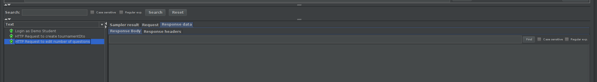

# ES20 P4 submission, Group 18

## Feature PPA

### Subgroup

 - Nome, istID, githubID
   + Issues assigned: [#1](https://github.com), [#3](https://github.com)
   + Tasks: F1:Service, F1:Spock Tests, etc
 - Nome, istID, githubID
   + Issues assigned: [#2](https://github.com), [#4](https://github.com)
   + Tasks: F2:Service, F2:Spock Tests, etc

### Pull requests associated with this feature

The list of pull requests associated with this feature is:

 - [PR #000](https://github.com)
 - [PR #001](https://github.com)
 - [PR #002](https://github.com)

### Listed features

Below, we list **only** the implemented features. For each feature, we link the relevant files and we mark which are requested parts are completed.

#### Feature number 1: _Uma questão aprovada pode passar a fazer parte do conjunto de perguntas disponíveis_

 - [x] [Service](https://github.com)
 - [x] [Spock tests](https://github.com)
 - [x] [JMeter feature tests](https://github.com)
   + Screenshots:

     

 - [x] [Cypress use case test](https://github.com)
   + Screenshot:

     

#### Feature number N: **TODO**

 - [x] [Service](https://github.com)
 - [x] [Spock tests](https://github.com)
 - [ ] [JMeter feature test](https://github.com)
 - [ ] [Cypress use case test](https://github.com)

### Additional features

**TODO**: if you have implemented additional features, describe them here (following the same format as above).

---

## Feature DDP

### Subgroup

 - Daniel Matos, ist189429, DMaxter
   + Issues assigned:
    [#222](https://github.com/tecnico-softeng/es20al_18-project/issues/222),
    [#224](https://github.com/tecnico-softeng/es20al_18-project/issues/224),
    [#225](https://github.com/tecnico-softeng/es20al_18-project/issues/225),
    [#227](https://github.com/tecnico-softeng/es20al_18-project/issues/227),
    [#232](https://github.com/tecnico-softeng/es20al_18-project/issues/232),
    [#233](https://github.com/tecnico-softeng/es20al_18-project/issues/233),
    [#234](https://github.com/tecnico-softeng/es20al_18-project/issues/234),
    [#238](https://github.com/tecnico-softeng/es20al_18-project/issues/238),
    [#239](https://github.com/tecnico-softeng/es20al_18-project/issues/239),
    [#240](https://github.com/tecnico-softeng/es20al_18-project/issues/240),
    [#241](https://github.com/tecnico-softeng/es20al_18-project/issues/241),
    [#242](https://github.com/tecnico-softeng/es20al_18-project/issues/242),
    [#243](https://github.com/tecnico-softeng/es20al_18-project/issues/243),
    [#247](https://github.com/tecnico-softeng/es20al_18-project/issues/247),
    [#248](https://github.com/tecnico-softeng/es20al_18-project/issues/248),
    [#249](https://github.com/tecnico-softeng/es20al_18-project/issues/249),
    [#279](https://github.com/tecnico-softeng/es20al_18-project/issues/249),
   + Tasks: Ddp\_4: Functionality and Spock Tests, Ddp\_4: Web Services, Ddp\_4: Frontend
            Ddp\_6: Functionality and Spock Tests, Ddp\_6: Web Services, Ddp\_6: Frontend
            Ddp\_7.1: Functionality and Spock Tests, Ddp\_7.1: Web Services, Ddp\_7.1: Frontend
            Ddp\_8: Functionality and Spock Tests, Ddp\_8: Web Services, Ddp\_8: Frontend

 - João Paquete, ist189477, jpaquete14
   + Issues assigned:
    [#223](https://github.com/tecnico-softeng/es20al_18-project/issues/223),
    [#226](https://github.com/tecnico-softeng/es20al_18-project/issues/226),
    [#235](https://github.com/tecnico-softeng/es20al_18-project/issues/235),
    [#236](https://github.com/tecnico-softeng/es20al_18-project/issues/236),
    [#237](https://github.com/tecnico-softeng/es20al_18-project/issues/237),
    [#244](https://github.com/tecnico-softeng/es20al_18-project/issues/244),
    [#245](https://github.com/tecnico-softeng/es20al_18-project/issues/245),
    [#246](https://github.com/tecnico-softeng/es20al_18-project/issues/246)
   + Tasks: Ddp\_5: Functionality and Spock Tests, Ddp\_5: Web Services, Ddp\_5: Frontend
            Ddp\_7.2: Functionality and Spock Tests, Ddp\_7.2: Web Services, Ddp\_7.2: Frontend

### Pull requests associated with this feature

The list of pull requests associated with this feature is:

 - [PR #262](https://github.com/tecnico-softeng/es20al_18-project/pull/262)
 - [PR #266](https://github.com/tecnico-softeng/es20al_18-project/pull/266)
 - [PR #271](https://github.com/tecnico-softeng/es20al_18-project/pull/271)
 - [PR #278](https://github.com/tecnico-softeng/es20al_18-project/pull/278)
 - [PR #282](https://github.com/tecnico-softeng/es20al_18-project/pull/282)
 - [PR #284](https://github.com/tecnico-softeng/es20al_18-project/pull/284)

### Listed features

Below, we list **only** the implemented features. For each feature, we link the relevant files and we mark which are requested parts are completed.

#### Feature number 4: _Student can create replies_

 - [x] [Service](https://github.com/tecnico-softeng/es20al_18-project/blob/p4/backend/src/main/java/pt/ulisboa/tecnico/socialsoftware/tutor/discussion/DiscussionService.java#L103)
 - [x] [Spock tests](https://github.com/tecnico-softeng/es20al_18-project/blob/p4/backend/src/test/groovy/pt/ulisboa/tecnico/socialsoftware/tutor/discussion/service/GiveExplanationTest.groovy)
 - [x] [JMeter feature tests](https://github.com/tecnico-softeng/es20al_18-project/blob/p4/backend/jmeter/discussion/WSCreateReplyTest.jmx)
   + Screenshots:

     

 - [x] [Cypress use case test](https://github.com/tecnico-softeng/es20al_18-project/blob/p4/frontend/tests/e2e/specs/student/discussion.js#L12)
   + Screenshot:

     

#### Feature number 5: _Teacher can make discussion and replies public_

 - [x] [Service](https://github.com/tecnico-softeng/es20al_18-project/blob/p4/backend/src/main/java/pt/ulisboa/tecnico/socialsoftware/tutor/discussion/DiscussionService.java#L94)
 - [x] [Spock tests](https://github.com/tecnico-softeng/es20al_18-project/blob/p4/backend/src/test/groovy/pt/ulisboa/tecnico/socialsoftware/tutor/discussion/service/SetAvailabilityTest.groovy)
 - [x] [JMeter feature tests](https://github.com/tecnico-softeng/es20al_18-project/blob/p4/backend/jmeter/discussion/WSSetAvailabilityTest.jmx)
   + Screenshots:

     

 - [x] [Cypress use case test](https://github.com/tecnico-softeng/es20al_18-project/blob/p4/frontend/tests/e2e/specs/teacher/submitReply.js#L27)
   + Screenshot:

     

#### Feature number 6: _Student can see public discussions after the quiz_

 - [ ] Service (not needed)
 - [ ] Spock tests (not applicable)
 - [ ] JMeter feature tests (not applicable)
 - [X] [Backend change](https://github.com/tecnico-softeng/es20al_18-project/blob/p4/backend/src/main/java/pt/ulisboa/tecnico/socialsoftware/tutor/statement/dto/StatementQuestionDto.java#L34)

 - [x] [Cypress use case test](https://github.com/tecnico-softeng/es20al_18-project/blob/p4/frontend/tests/e2e/specs/student/discussion.js#L28)
   + Screenshot:

     

#### Feature number 7.1: _Student dashboard with his number of discussions_

 - [x] [Service](https://github.com/tecnico-softeng/es20al_18-project/blob/p4/backend/src/main/java/pt/ulisboa/tecnico/socialsoftware/tutor/user/UserService.java#L102)
 - [x] [Spock tests](https://github.com/tecnico-softeng/es20al_18-project/blob/p4/backend/src/test/groovy/pt/ulisboa/tecnico/socialsoftware/tutor/user/service/GetDashboardInfoTest.groovy)
 - [x] [JMeter feature tests](https://github.com/tecnico-softeng/es20al_18-project/blob/p4/backend/jmeter/user/WSGetDashboardInfo.jmx)
   + Screenshots:

     

 - [x] [Cypress use case test](https://github.com/tecnico-softeng/es20al_18-project/blob/p4/frontend/tests/e2e/specs/student/checkDashboardInfo.js#L15)
   + Screenshot:

     

#### Feature number 7.2: _Student dashboard with his number of public discussions_

 - [x] [Service](https://github.com/tecnico-softeng/es20al_18-project/blob/p4/backend/src/main/java/pt/ulisboa/tecnico/socialsoftware/tutor/user/UserService.java#L102)
 - [x] [Spock tests](https://github.com/tecnico-softeng/es20al_18-project/blob/p4/backend/src/test/groovy/pt/ulisboa/tecnico/socialsoftware/tutor/user/service/GetDashboardInfoTest.groovy)
 - [x] [JMeter feature tests](https://github.com/tecnico-softeng/es20al_18-project/blob/p4/backend/jmeter/user/WSGetDashboardInfo.jmx)
   + Screenshots:

     

 - [x] [Cypress use case test](https://github.com/tecnico-softeng/es20al_18-project/blob/p4/frontend/tests/e2e/specs/student/checkDashboardInfo.js#L15)
   + Screenshot:

     

#### Feature number 8: _Student decides whether his discussion stats are public or private_

 - [x] [Service](https://github.com/tecnico-softeng/es20al_18-project/blob/p4/backend/src/main/java/pt/ulisboa/tecnico/socialsoftware/tutor/user/UserService.java#L114)
 - [x] [Spock tests](https://github.com/tecnico-softeng/es20al_18-project/blob/p4/backend/src/test/groovy/pt/ulisboa/tecnico/socialsoftware/tutor/user/service/DashboardInfoVisibilityTest.groovy)
 - [x] [JMeter feature tests](https://github.com/tecnico-softeng/es20al_18-project/blob/p4/backend/jmeter/user/WSChangeDiscussionStatsVisibility.jmx)
   + Screenshots:

     

 - [ ] Cypress use case test
    + Since the test would only be clicking on a button without any visible consequence on the student's side, we chose not to implement it

### Additional features

---

## Feature TDP

### Subgroup

 - João Dinis, ist189485, JDinis99
   + Issues assigned: [#204](https://github.com/tecnico-softeng/es20al_18-project/issues/204), [#205](https://github.com/tecnico-softeng/es20al_18-project/issues/205), [#206](https://github.com/tecnico-softeng/es20al_18-project/issues/206),
        [#207](https://github.com/tecnico-softeng/es20al_18-project/issues/207), [#208](https://github.com/tecnico-softeng/es20al_18-project/issues/208), [#209](https://github.com/tecnico-softeng/es20al_18-project/issues/209),
        [#213](https://github.com/tecnico-softeng/es20al_18-project/issues/213), [#214](https://github.com/tecnico-softeng/es20al_18-project/issues/214), [#215](https://github.com/tecnico-softeng/es20al_18-project/issues/215),
        [#216](https://github.com/tecnico-softeng/es20al_18-project/issues/216), [#217](https://github.com/tecnico-softeng/es20al_18-project/issues/217), [#218](https://github.com/tecnico-softeng/es20al_18-project/issues/218)
   + Tasks: Tdp\_5: Functionality and Spock Tests, Tdp\_5: Web Services, Tdp\_5: Frontend,
        Tdp\_6: Functionality and Spock Tests, Tdp\_6: Web Services, Tdp\_6: Frontend,
        Tdp\_8: Functionality and Spock Tests, Tdp\_8: Web Services, Tdp\_8: Frontend,
        Tdp\_9: Functionality and Spock Tests, Tdp\_9: Web Services, Tdp\_9: Frontend
 - Tiago Fonseca, ist189542, TiagoFonseca99
   + Issues assigned: [#201](https://github.com/tecnico-softeng/es20al_18-project/issues/201), [#202](https://github.com/tecnico-softeng/es20al_18-project/issues/202), [#203](https://github.com/tecnico-softeng/es20al_18-project/issues/203),
        [#210](https://github.com/tecnico-softeng/es20al_18-project/issues/210), [#211](https://github.com/tecnico-softeng/es20al_18-project/issues/211), [#212](https://github.com/tecnico-softeng/es20al_18-project/issues/212),
        [#219](https://github.com/tecnico-softeng/es20al_18-project/issues/219), [#220](https://github.com/tecnico-softeng/es20al_18-project/issues/220), [#221](https://github.com/tecnico-softeng/es20al_18-project/issues/221)
   + Tasks: Tdp\_4: Functionality and Spock Tests, Tdp\_4: Web Services, Tdp\_4: Frontend,
        Tdp\_7: Functionality and Spock Tests, Tdp\_7: Web Services, Tdp\_7: Frontend,
        Tdp\_10: Functionality and Spock Tests, Tdp\_10: Web Services, Tdp\_10: Frontend

### Pull requests associated with this feature

The list of pull requests associated with this feature is:

 - [PR #263](https://github.com/tecnico-softeng/es20al_18-project/pull/263)
 - [PR #267](https://github.com/tecnico-softeng/es20al_18-project/pull/267)
 - [PR #270](https://github.com/tecnico-softeng/es20al_18-project/pull/270)
 - [PR #281](https://github.com/tecnico-softeng/es20al_18-project/pull/281)

### Listed features

Below, we list **only** the implemented features. For each feature, we link the relevant files and we mark which are requested parts are completed. Feature 1 to 3 were implemented in the previous sprints.

#### Feature number 4: Tournament creator can cancel it.

 - [x] [Service](https://github.com/tecnico-softeng/es20al_18-project/blob/94514e4d2eceffb3eb2f2b079e5fe64233c5d766/backend/src/main/java/pt/ulisboa/tecnico/socialsoftware/tutor/tournament/TournamentService.java#L127)
 - [x] [Spock tests](https://github.com/tecnico-softeng/es20al_18-project/blob/94514e4d2eceffb3eb2f2b079e5fe64233c5d766/backend/src/test/groovy/pt/ulisboa/tecnico/socialsoftware/tutor/tournament/service/CancelTournamentTest.groovy)
 - [x] [JMeter feature tests](https://github.com/tecnico-softeng/es20al_18-project/blob/ad0b2f23f1cf7a4251f2f8c922f1b191c2bd8fde/backend/jmeter/user/WSChangeTournamentStatsVisibility.jmx)
   + Screenshots:

     

 - [x] [Cypress use case test](https://github.com/tecnico-softeng/es20al_18-project/blob/94514e4d2eceffb3eb2f2b079e5fe64233c5d766/frontend/tests/e2e/specs/student/tournament.js#L48)
   + Screenshot:

     

#### Feature number 5: If number of enrolled students, including creator, is above 1 the system generates a quiz associated to the tournament.

 - [x] [Service](https://github.com/tecnico-softeng/es20al_18-project/blob/94514e4d2eceffb3eb2f2b079e5fe64233c5d766/backend/src/main/java/pt/ulisboa/tecnico/socialsoftware/tutor/tournament/TournamentService.java#L214)
 - [x] [Spock tests](https://github.com/tecnico-softeng/es20al_18-project/blob/94514e4d2eceffb3eb2f2b079e5fe64233c5d766/backend/src/test/groovy/pt/ulisboa/tecnico/socialsoftware/tutor/tournament/service/GetQuizIdTest.groovy)
 - [x] [JMeter feature tests](https://github.com/tecnico-softeng/es20al_18-project/blob/94514e4d2eceffb3eb2f2b079e5fe64233c5d766/backend/jmeter/tournament/WSGetQuizId.jmx)
   + Screenshots:

     

 - [x] [Cypress use case test](https://github.com/tecnico-softeng/es20al_18-project/blob/94514e4d2eceffb3eb2f2b079e5fe64233c5d766/frontend/tests/e2e/specs/student/tournament.js#L74)
   + Screenshot:

     

#### Feature number 6: Students can answer the tournament quiz.

 - [x] [Service](https://github.com/tecnico-softeng/es20al_18-project/blob/94514e4d2eceffb3eb2f2b079e5fe64233c5d766/backend/src/main/java/pt/ulisboa/tecnico/socialsoftware/tutor/tournament/TournamentService.java#L274)
 - [x] [Spock tests](https://github.com/tecnico-softeng/es20al_18-project/blob/94514e4d2eceffb3eb2f2b079e5fe64233c5d766/backend/src/test/groovy/pt/ulisboa/tecnico/socialsoftware/tutor/tournament/service/GetQuizIdTest.groovy)
 - [x] [JMeter feature tests](https://github.com/tecnico-softeng/es20al_18-project/blob/94514e4d2eceffb3eb2f2b079e5fe64233c5d766/backend/jmeter/tournament/WSGetQuizId.jmx)
   + Screenshots:

     

 - [x] [Cypress use case test](https://github.com/tecnico-softeng/es20al_18-project/blob/94514e4d2eceffb3eb2f2b079e5fe64233c5d766/frontend/tests/e2e/specs/student/tournament.js#L74)
   + Screenshot:

     

#### Feature number 7: Student Dashboard

 - [x] [Service](https://github.com/tecnico-softeng/es20al_18-project/blob/94514e4d2eceffb3eb2f2b079e5fe64233c5d766/backend/src/main/java/pt/ulisboa/tecnico/socialsoftware/tutor/user/UserService.java#L90)
 - [x] [Spock tests](https://github.com/tecnico-softeng/es20al_18-project/blob/94514e4d2eceffb3eb2f2b079e5fe64233c5d766/backend/src/test/groovy/pt/ulisboa/tecnico/socialsoftware/tutor/user/service/GetDashboardInfoTest.groovy)
 - [x] [JMeter feature tests - Atualizar](https://github.com)
   + Screenshots:

     

 - [x] [Cypress use case test - Atualizar]()
   + Screenshot:

     

#### Feature number 8: Student can change tournament privacy settings on his dashboard

 - [x] [Service](https://github.com/tecnico-softeng/es20al_18-project/blob/94514e4d2eceffb3eb2f2b079e5fe64233c5d766/backend/src/main/java/pt/ulisboa/tecnico/socialsoftware/tutor/user/UserService.java#L134)
 - [x] [Spock tests](https://github.com/tecnico-softeng/es20al_18-project/blob/94514e4d2eceffb3eb2f2b079e5fe64233c5d766/backend/src/test/groovy/pt/ulisboa/tecnico/socialsoftware/tutor/tournament/service/ChangeTournamentPermissionsTest.groovy)
 - [x] [JMeter feature tests](https://github.com/tecnico-softeng/es20al_18-project/blob/94514e4d2eceffb3eb2f2b079e5fe64233c5d766/backend/jmeter/user/WSGetTounamentPermissionsTest.jmx)
   + Screenshots:

     

 - [x] [Cypress use case test - Atualizar]()
   + Screenshot:

     

### Additional features

#### Feature number 9: Student can leave the tournament

 - [x] [Service](https://github.com/tecnico-softeng/es20al_18-project/blob/94514e4d2eceffb3eb2f2b079e5fe64233c5d766/backend/src/main/java/pt/ulisboa/tecnico/socialsoftware/tutor/tournament/TournamentService.java#L252)
 - [x] [Spock tests](https://github.com/tecnico-softeng/es20al_18-project/blob/b06469cab54099132d5ab5b8b18ff1866a883fc1/backend/src/test/groovy/pt/ulisboa/tecnico/socialsoftware/tutor/tournament/service/StudentLeaveTournamentTest.groovy)
 - [x] [JMeter feature tests](https://github.com/tecnico-softeng/es20al_18-project/blob/94514e4d2eceffb3eb2f2b079e5fe64233c5d766/backend/jmeter/tournament/WSleaveTournamentTest.jmx)
   + Screenshots:

     

 - [x] [Cypress use case test](https://github.com/tecnico-softeng/es20al_18-project/blob/94514e4d2eceffb3eb2f2b079e5fe64233c5d766/frontend/tests/e2e/specs/student/tournament.js#L66)
   + Screenshot:

     

#### Feature number 10: Tournament creator can edit the tournament start time, end time and number of questions.

 - [x] [Service](https://github.com/tecnico-softeng/es20al_18-project/blob/94514e4d2eceffb3eb2f2b079e5fe64233c5d766/backend/src/main/java/pt/ulisboa/tecnico/socialsoftware/tutor/tournament/TournamentService.java#L314)
 - [x] [Spock tests](https://github.com/tecnico-softeng/es20al_18-project/blob/94514e4d2eceffb3eb2f2b079e5fe64233c5d766/backend/src/test/groovy/pt/ulisboa/tecnico/socialsoftware/tutor/tournament/service/EditTournamentTest.groovy)
 - [x] [JMeter feature tests.1](https://github.com/tecnico-softeng/es20al_18-project/blob/94514e4d2eceffb3eb2f2b079e5fe64233c5d766/backend/jmeter/tournament/WSEditStartTimeTest.jmx)
 - [x] [JMeter feature tests.2](https://github.com/tecnico-softeng/es20al_18-project/blob/94514e4d2eceffb3eb2f2b079e5fe64233c5d766/backend/jmeter/tournament/WSEditEndTimeTest.jmx)
 - [x] [JMeter feature tests.3](https://github.com/tecnico-softeng/es20al_18-project/blob/94514e4d2eceffb3eb2f2b079e5fe64233c5d766/backend/jmeter/tournament/WSEditNumberOfQuestionsTest.jmx)
 - [x] [JMeter feature tests.4](https://github.com/tecnico-softeng/es20al_18-project/blob/94514e4d2eceffb3eb2f2b079e5fe64233c5d766/backend/jmeter/tournament/WSAddTopicsTest.jmx)
 - [x] [JMeter feature tests.5](https://github.com/tecnico-softeng/es20al_18-project/blob/94514e4d2eceffb3eb2f2b079e5fe64233c5d766/backend/jmeter/tournament/WSRemoveTopicsTest.jmx)
   + Screenshots:

     
     
     
     
     

 - [x] [Cypress use case test](https://github.com/tecnico-softeng/es20al_18-project/blob/94514e4d2eceffb3eb2f2b079e5fe64233c5d766/frontend/tests/e2e/specs/student/tournament.js#L37)
   + Screenshot:

          

---
