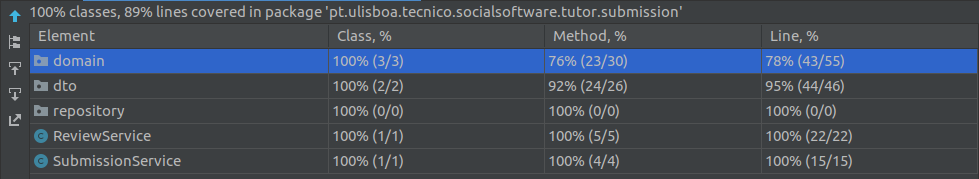
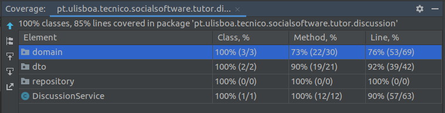

# ES20 P1 submission, Group 18

## Feature PPA

### Subgroup
 - Daniel Serafim, ist189428, dserafim1999
   + Issues assigned: [#7](https://github.com/tecnico-softeng/es20al_18-project/issues/7), [#16](https://github.com/tecnico-softeng/es20al_18-project/issues/16), [#17](https://github.com/tecnico-softeng/es20al_18-project/issues/17), [#19](https://github.com/tecnico-softeng/es20al_18-project/issues/19), [#29](https://github.com/tecnico-softeng/es20al_18-project/issues/29), [#45](https://github.com/tecnico-softeng/es20al_18-project/issues/45), [#46](https://github.com/tecnico-softeng/es20al_18-project/issues/46), [#47](https://github.com/tecnico-softeng/es20al_18-project/issues/47), [#49](https://github.com/tecnico-softeng/es20al_18-project/issues/49), [#61](https://github.com/tecnico-softeng/es20al_18-project/issues/61)
 - Tomás Inácio, ist189553, tomas1999set
   + Issues assigned: [#18](https://github.com/tecnico-softeng/es20al_18-project/issues/18), [#30](https://github.com/tecnico-softeng/es20al_18-project/issues/30), [#43](https://github.com/tecnico-softeng/es20al_18-project/issues/43), [#48](https://github.com/tecnico-softeng/es20al_18-project/issues/48), [#60](https://github.com/tecnico-softeng/es20al_18-project/issues/60)
 
### Pull requests associated with this feature

The list of pull requests associated with this feature is:

 - [PR #020](https://github.com/tecnico-softeng/es20al_18-project/pull/20)
 - [PR #032](https://github.com/tecnico-softeng/es20al_18-project/pull/32)
 - [PR #062](https://github.com/tecnico-softeng/es20al_18-project/pull/62)

### New/Updated domain entities

#### New entities
 - [Submission.java](https://github.com/tecnico-softeng/es20al_18-project/blob/a46c0be088206d747d653c42b206b4d2be598c6b/backend/src/main/java/pt/ulisboa/tecnico/socialsoftware/tutor/submission/domain/Submission.java)
 - [SubmissionDto.java](https://github.com/tecnico-softeng/es20al_18-project/blob/a46c0be088206d747d653c42b206b4d2be598c6b/backend/src/main/java/pt/ulisboa/tecnico/socialsoftware/tutor/submission/dto/SubmissionDto.java)
 - [SubmissionRepository.java](https://github.com/tecnico-softeng/es20al_18-project/blob/a46c0be088206d747d653c42b206b4d2be598c6b/backend/src/main/java/pt/ulisboa/tecnico/socialsoftware/tutor/submission/repository/SubmissionRepository.java)
 - [SubmissionService.java](https://github.com/tecnico-softeng/es20al_18-project/blob/a46c0be088206d747d653c42b206b4d2be598c6b/backend/src/main/java/pt/ulisboa/tecnico/socialsoftware/tutor/submission/SubmissionService.java)
 - [Review.java](https://github.com/tecnico-softeng/es20al_18-project/blob/a46c0be088206d747d653c42b206b4d2be598c6b/backend/src/main/java/pt/ulisboa/tecnico/socialsoftware/tutor/submission/domain/Review.java)
 - [ReviewDto.java](https://github.com/tecnico-softeng/es20al_18-project/blob/a46c0be088206d747d653c42b206b4d2be598c6b/backend/src/main/java/pt/ulisboa/tecnico/socialsoftware/tutor/submission/dto/ReviewDto.java)
 - [ReviewRepository.java](https://github.com/tecnico-softeng/es20al_18-project/blob/a46c0be088206d747d653c42b206b4d2be598c6b/backend/src/main/java/pt/ulisboa/tecnico/socialsoftware/tutor/submission/repository/ReviewRepository.java)

 - [CreateSubmissionTest.groovy](https://github.com/tecnico-softeng/es20al_18-project/blob/a46c0be088206d747d653c42b206b4d2be598c6b/backend/src/test/groovy/pt/ulisboa/tecnico/socialsoftware/tutor/submission/service/CreateSubmissionTest.groovy)
 - [CreateReviewTest.groovy](https://github.com/tecnico-softeng/es20al_18-project/blob/a46c0be088206d747d653c42b206b4d2be598c6b/backend/src/test/groovy/pt/ulisboa/tecnico/socialsoftware/tutor/submission/service/CreateReviewTest.groovy)
 - [GetSubmissionStatus.groovy](https://github.com/tecnico-softeng/es20al_18-project/blob/a46c0be088206d747d653c42b206b4d2be598c6b/backend/src/test/groovy/pt/ulisboa/tecnico/socialsoftware/tutor/submission/service/GetSubmissionStatusTest.groovy)

#### Entities changed
 - [ErrorMessage.java](https://github.com/tecnico-softeng/es20al_18-project/blob/a46c0be088206d747d653c42b206b4d2be598c6b/backend/src/main/java/pt/ulisboa/tecnico/socialsoftware/tutor/exceptions/ErrorMessage.java)
   + Added field `SUBMISSION_MISSING_QUESTION`
   + Added field `SUBMISSION_MISSING_STUDENT`
   + Added field `SUBMISSION_NOT_FOUND`
   + Added field `REVIEW_MISSING_JUSTIFICATION`
   + Added field `REVIEW_MISSING_SUBMISSION`
   + Added field `REVIEW_MISSING_STUDENT`
   + Added field `REVIEW_MISSING_STATUS`
   + Added field `QUESTION_ALREADY_SUBMITTED`
   + Added field `QUESTION_ALREADY_APPROVED`
   + Added field `USER_NOT_STUDENT`
   + Added field `USER_NOT_TEACHER`

 - [Image.java](https://github.com/tecnico-softeng/es20al_18-project/blob/a46c0be088206d747d653c42b206b4d2be598c6b/backend/src/main/java/pt/ulisboa/tecnico/socialsoftware/tutor/question/domain/Image.java)
   + Added field `review`

 - [User.java](https://github.com/tecnico-softeng/es20al_18-project/blob/a46c0be088206d747d653c42b206b4d2be598c6b/backend/src/main/java/pt/ulisboa/tecnico/socialsoftware/tutor/user/User.java)
   + Added field `submissions` 
   + Added field `reviews` 

### Feature testing

We define one success test, one insuccess test, and tests for invalid input. The direct links to these are:

 - [CreateSubmissionTest.groovy](https://github.com/tecnico-softeng/es20al_18-project/blob/a46c0be088206d747d653c42b206b4d2be598c6b/backend/src/test/groovy/pt/ulisboa/tecnico/socialsoftware/tutor/submission/service/CreateSubmissionTest.groovy)
    + [Success test #1](https://github.com/tecnico-softeng/es20al_18-project/blob/a46c0be088206d747d653c42b206b4d2be598c6b/backend/src/test/groovy/pt/ulisboa/tecnico/socialsoftware/tutor/submission/service/CreateSubmissionTest.groovy#L87)
    + [Success test #2](https://github.com/tecnico-softeng/es20al_18-project/blob/a46c0be088206d747d653c42b206b4d2be598c6b/backend/src/test/groovy/pt/ulisboa/tecnico/socialsoftware/tutor/submission/service/CreateSubmissionTest.groovy#L119)
    + [Success test #3](https://github.com/tecnico-softeng/es20al_18-project/blob/a46c0be088206d747d653c42b206b4d2be598c6b/backend/src/test/groovy/pt/ulisboa/tecnico/socialsoftware/tutor/submission/service/CreateSubmissionTest.groovy#L152)
    + [Insuccess test #1](https://github.com/tecnico-softeng/es20al_18-project/blob/a46c0be088206d747d653c42b206b4d2be598c6b/backend/src/test/groovy/pt/ulisboa/tecnico/socialsoftware/tutor/submission/service/CreateSubmissionTest.groovy#L106)
    + [Insuccess test #2](https://github.com/tecnico-softeng/es20al_18-project/blob/a46c0be088206d747d653c42b206b4d2be598c6b/backend/src/test/groovy/pt/ulisboa/tecnico/socialsoftware/tutor/submission/service/CreateSubmissionTest.groovy#L131)
    + [Tests for invalid input](https://github.com/tecnico-softeng/es20al_18-project/blob/a46c0be088206d747d653c42b206b4d2be598c6b/backend/src/test/groovy/pt/ulisboa/tecnico/socialsoftware/tutor/submission/service/CreateSubmissionTest.groovy#L166)
- [CreateReviewTest.groovy](https://github.com/tecnico-softeng/es20al_18-project/blob/a46c0be088206d747d653c42b206b4d2be598c6b/backend/src/test/groovy/pt/ulisboa/tecnico/socialsoftware/tutor/submission/service/CreateReviewTest.groovy)
    + [Success test #1](https://github.com/tecnico-softeng/es20al_18-project/blob/a46c0be088206d747d653c42b206b4d2be598c6b/backend/src/test/groovy/pt/ulisboa/tecnico/socialsoftware/tutor/submission/service/CreateReviewTest.groovy#L130)
    + [Success test #2](https://github.com/tecnico-softeng/es20al_18-project/blob/a46c0be088206d747d653c42b206b4d2be598c6b/backend/src/test/groovy/pt/ulisboa/tecnico/socialsoftware/tutor/submission/service/CreateReviewTest.groovy#L170)
    + [Insuccess test #1](https://github.com/tecnico-softeng/es20al_18-project/blob/a46c0be088206d747d653c42b206b4d2be598c6b/backend/src/test/groovy/pt/ulisboa/tecnico/socialsoftware/tutor/submission/service/CreateReviewTest.groovy#L153)
    + [Insuccess test #2](https://github.com/tecnico-softeng/es20al_18-project/blob/a46c0be088206d747d653c42b206b4d2be598c6b/backend/src/test/groovy/pt/ulisboa/tecnico/socialsoftware/tutor/submission/service/CreateReviewTest.groovy#L112)
    + [Insuccess test #3](https://github.com/tecnico-softeng/es20al_18-project/blob/a46c0be088206d747d653c42b206b4d2be598c6b/backend/src/test/groovy/pt/ulisboa/tecnico/socialsoftware/tutor/submission/service/CreateReviewTest.groovy#L197)
    + [Tests for invalid input](https://github.com/tecnico-softeng/es20al_18-project/blob/a46c0be088206d747d653c42b206b4d2be598c6b/backend/src/test/groovy/pt/ulisboa/tecnico/socialsoftware/tutor/submission/service/CreateReviewTest.groovy#L215)
- [GetSubmissionStatusTest.groovy](https://github.com/tecnico-softeng/es20al_18-project/blob/a46c0be088206d747d653c42b206b4d2be598c6b/backend/src/test/groovy/pt/ulisboa/tecnico/socialsoftware/tutor/submission/service/GetSubmissionStatusTest.groovy)
    + [Success test #1](https://github.com/tecnico-softeng/es20al_18-project/blob/a46c0be088206d747d653c42b206b4d2be598c6b/backend/src/test/groovy/pt/ulisboa/tecnico/socialsoftware/tutor/submission/service/GetSubmissionStatusTest.groovy#L100)
    + [Success test #2](https://github.com/tecnico-softeng/es20al_18-project/blob/a46c0be088206d747d653c42b206b4d2be598c6b/backend/src/test/groovy/pt/ulisboa/tecnico/socialsoftware/tutor/submission/service/GetSubmissionStatusTest.groovy#L122)
    + [Success test #3](https://github.com/tecnico-softeng/es20al_18-project/blob/a46c0be088206d747d653c42b206b4d2be598c6b/backend/src/test/groovy/pt/ulisboa/tecnico/socialsoftware/tutor/submission/service/GetSubmissionStatusTest.groovy#L158)
    + [Success test #4](https://github.com/tecnico-softeng/es20al_18-project/blob/a46c0be088206d747d653c42b206b4d2be598c6b/backend/src/test/groovy/pt/ulisboa/tecnico/socialsoftware/tutor/submission/service/GetSubmissionStatusTest.groovy#L194)
    + [Test for invalid input](https://github.com/tecnico-softeng/es20al_18-project/blob/a46c0be088206d747d653c42b206b4d2be598c6b/backend/src/test/groovy/pt/ulisboa/tecnico/socialsoftware/tutor/submission/service/GetSubmissionStatusTest.groovy#L202)

### Test Coverage Screenshot

The screenshot includes the test coverage results associated with the new/changed entities:
(We didn't add extra tests for untested domain or dto getters and setters)

---

## Feature DDP

### Subgroup
 - Daniel Matos, ist189429, DMaxter
   + Issues assigned: [#3](https://github.com/tecnico-softeng/es20al_18-project/issues/3), [#8](https://github.com/tecnico-softeng/es20al_18-project/issues/8), [#9](https://github.com/tecnico-softeng/es20al_18-project/issues/9), [#10](https://github.com/tecnico-softeng/es20al_18-project/issues/10), [#56](https://github.com/tecnico-softeng/es20al_18-project/issues/56), [#57](https://github.com/tecnico-softeng/es20al_18-project/issues/57), [#58](https://github.com/tecnico-softeng/es20al_18-project/issues/58), [#59](https://github.com/tecnico-softeng/es20al_18-project/issues/59)
 - João Paquete, ist189477, jpaquete14
   + Issues assigned: [#51](https://github.com/tecnico-softeng/es20al_18-project/issues/51), [#52](https://github.com/tecnico-softeng/es20al_18-project/issues/52), [#53](https://github.com/tecnico-softeng/es20al_18-project/issues/53), [#65](https://github.com/tecnico-softeng/es20al_18-project/issues/65)
 
### Pull requests associated with this feature

The list of pull requests associated with this feature is:

 - [PR #022](https://github.com/tecnico-softeng/es20al_18-project/pull/22)
 - [PR #033](https://github.com/tecnico-softeng/es20al_18-project/pull/33)
 - [PR #044](https://github.com/tecnico-softeng/es20al_18-project/pull/44)
 - [PR #063](https://github.com/tecnico-softeng/es20al_18-project/pull/63)

### New/Updated domain entities

#### New entities
 - [DiscussionService.java](https://github.com/tecnico-softeng/es20al_18-project/blob/develop/backend/src/main/java/pt/ulisboa/tecnico/socialsoftware/tutor/discussion/DiscussionService.java)
 - [Discussion.java](https://github.com/tecnico-softeng/es20al_18-project/blob/develop/backend/src/main/java/pt/ulisboa/tecnico/socialsoftware/tutor/discussion/domain/Discussion.java)
 - [DiscussionDto.java](https://github.com/tecnico-softeng/es20al_18-project/blob/develop/backend/src/main/java/pt/ulisboa/tecnico/socialsoftware/tutor/discussion/dto/DiscussionDto.java)
 - [DiscussionRepository.java](https://github.com/tecnico-softeng/es20al_18-project/blob/develop/backend/src/main/java/pt/ulisboa/tecnico/socialsoftware/tutor/discussion/repository/DiscussionRepository.java)

 - [Reply.java](https://github.com/tecnico-softeng/es20al_18-project/blob/develop/backend/src/main/java/pt/ulisboa/tecnico/socialsoftware/tutor/discussion/domain/Reply.java)
 - [ReplyDto.java](https://github.com/tecnico-softeng/es20al_18-project/blob/develop/backend/src/main/java/pt/ulisboa/tecnico/socialsoftware/tutor/discussion/dto/ReplyDto.java)
 - [ReplyRepository.java](https://github.com/tecnico-softeng/es20al_18-project/blob/develop/backend/src/main/java/pt/ulisboa/tecnico/socialsoftware/tutor/discussion/repository/ReplyRepository.java)

#### Entities changed
 - [ErrorMessage.java](https://github.com/tecnico-softeng/es20al_18-project/blob/develop/backend/src/main/java/pt/ulisboa/tecnico/socialsoftware/tutor/exceptions/ErrorMessage.java)
   + Added field `DISCUSSION_NOT_FOUND`
   + Added field `REPLY_NOT_FOUND`
   + Added field `DUPLICATE_DISCUSSION`
   + Added field `DISCUSSION_NOT_SUBMITTED_BY_REQUESTER`
   + Added field `DISCUSSION_MISSING_DATA`
   + Added field `DISCUSSION_NOT_STUDENT_CREATOR`
   + Added field `REPLY_MISSING_DATA`
   + Added field `REPLY_NOT_TEACHER_CREATOR`
   + Added field `DUPLICATE_REPLY`

- [Question.java](https://github.com/tecnico-softeng/es20al_18-project/blob/develop/backend/src/main/java/pt/ulisboa/tecnico/socialsoftware/tutor/question/domain/Question.java)
   + Added field `discussions`

- [User.java](https://github.com/tecnico-softeng/es20al_18-project/blob/develop/backend/src/main/java/pt/ulisboa/tecnico/socialsoftware/tutor/user/User.java)
   + Added field `discussions`
   + Added field `replies`

 
### Feature testing

We define one success tests one insuccess test, and tests for invalid input. The direct links to these are:

 - [CreateDiscussionTest.groovy](https://github.com/tecnico-softeng/es20al_18-project/blob/96ced2470425779010077faeb89ae1fba2309da6/backend/src/test/groovy/pt/ulisboa/tecnico/socialsoftware/tutor/discussion/service/CreateDiscussionTest.groovy)
    + [Success test #1](https://github.com/tecnico-softeng/es20al_18-project/blob/96ced2470425779010077faeb89ae1fba2309da6/backend/src/test/groovy/pt/ulisboa/tecnico/socialsoftware/tutor/discussion/service/CreateDiscussionTest.groovy#L112)
    + [Insuccess test #1](https://github.com/tecnico-softeng/es20al_18-project/blob/96ced2470425779010077faeb89ae1fba2309da6/backend/src/test/groovy/pt/ulisboa/tecnico/socialsoftware/tutor/discussion/service/CreateDiscussionTest.groovy#L146)
    + [Insuccess test #2](https://github.com/tecnico-softeng/es20al_18-project/blob/96ced2470425779010077faeb89ae1fba2309da6/backend/src/test/groovy/pt/ulisboa/tecnico/socialsoftware/tutor/discussion/service/CreateDiscussionTest.groovy#L161)
    + [Insuccess test #3](https://github.com/tecnico-softeng/es20al_18-project/blob/96ced2470425779010077faeb89ae1fba2309da6/backend/src/test/groovy/pt/ulisboa/tecnico/socialsoftware/tutor/discussion/service/CreateDiscussionTest.groovy#L176)
    + [Tests for invalid input](https://github.com/tecnico-softeng/es20al_18-project/blob/96ced2470425779010077faeb89ae1fba2309da6/backend/src/test/groovy/pt/ulisboa/tecnico/socialsoftware/tutor/discussion/service/CreateDiscussionTest.groovy#L201)

- [GetTeacherReplyTest.groovy](https://github.com/tecnico-softeng/es20al_18-project/blob/96ced2470425779010077faeb89ae1fba2309da6/backend/src/test/groovy/pt/ulisboa/tecnico/socialsoftware/tutor/discussion/service/GetTeacherReplyTest.groovy)
    + [Success test #1](https://github.com/tecnico-softeng/es20al_18-project/blob/96ced2470425779010077faeb89ae1fba2309da6/backend/src/test/groovy/pt/ulisboa/tecnico/socialsoftware/tutor/discussion/service/GetTeacherReplyTest.groovy#L151)
    + [Success test #2](https://github.com/tecnico-softeng/es20al_18-project/blob/96ced2470425779010077faeb89ae1fba2309da6/backend/src/test/groovy/pt/ulisboa/tecnico/socialsoftware/tutor/discussion/service/GetTeacherReplyTest.groovy#L164)
    + [Insuccess test #1](https://github.com/tecnico-softeng/es20al_18-project/blob/96ced2470425779010077faeb89ae1fba2309da6/backend/src/test/groovy/pt/ulisboa/tecnico/socialsoftware/tutor/discussion/service/GetTeacherReplyTest.groovy#L174)

- [GiveExplanationTest.groovy](https://github.com/tecnico-softeng/es20al_18-project/blob/96ced2470425779010077faeb89ae1fba2309da6/backend/src/test/groovy/pt/ulisboa/tecnico/socialsoftware/tutor/discussion/service/GiveExplanationTest.groovy)
    + [Success test #1](https://github.com/tecnico-softeng/es20al_18-project/blob/96ced2470425779010077faeb89ae1fba2309da6/backend/src/test/groovy/pt/ulisboa/tecnico/socialsoftware/tutor/discussion/service/GiveExplanationTest.groovy#L122)
    + [Insuccess test #1](https://github.com/tecnico-softeng/es20al_18-project/blob/96ced2470425779010077faeb89ae1fba2309da6/backend/src/test/groovy/pt/ulisboa/tecnico/socialsoftware/tutor/discussion/service/GiveExplanationTest.groovy#L140)
    + [Insuccess test #2](https://github.com/tecnico-softeng/es20al_18-project/blob/96ced2470425779010077faeb89ae1fba2309da6/backend/src/test/groovy/pt/ulisboa/tecnico/socialsoftware/tutor/discussion/service/GiveExplanationTest.groovy#L155)

### Test Coverage Screenshot

The screenshot includes the test coverage results associated with the new/changed entities:

---

## Feature TDP

### Subgroup
 - João Dinis, ist189485, JDinis99
   + Issues assigned: [#1](https://github.com/tecnico-softeng/es20al_18-project/issues/1), [#4](https://github.com/tecnico-softeng/es20al_18-project/issues/4), [#13](https://github.com/tecnico-softeng/es20al_18-project/issues/13), [#14](https://github.com/tecnico-softeng/es20al_18-project/issues/14)
 - Tiago Fonseca, ist189542, TiagoFonseca99
   + Issues assigned: [#24](https://github.com/tecnico-softeng/es20al_18-project/issues/14), [#25](https://github.com/tecnico-softeng/es20al_18-project/issues/25), [#27](https://github.com/tecnico-softeng/es20al_18-project/issues/27), [#28](https://github.com/tecnico-softeng/es20al_18-project/issues/28), [#34](https://github.com/tecnico-softeng/es20al_18-project/issues/34), [#36](https://github.com/tecnico-softeng/es20al_18-project/issues/36), [#37](https://github.com/tecnico-softeng/es20al_18-project/issues/37), [#39](https://github.com/tecnico-softeng/es20al_18-project/issues/39)
 
### Pull requests associated with this feature

The list of pull requests associated with this feature is:

 - [PR #021](https://github.com/tecnico-softeng/es20al_18-project/pull/21)
 - [PR #035](https://github.com/tecnico-softeng/es20al_18-project/pull/35)
 - [PR #038](https://github.com/tecnico-softeng/es20al_18-project/pull/38)
 - [PR #054](https://github.com/tecnico-softeng/es20al_18-project/pull/54)

### New/Updated domain entities

#### New entities
 - [TournamentService.java](https://github.com/tecnico-softeng/es20al_18-project/blob/develop/backend/src/main/java/pt/ulisboa/tecnico/socialsoftware/tutor/tournament/TournamentService.java)
 - [Tournament.java](https://github.com/tecnico-softeng/es20al_18-project/blob/develop/backend/src/main/java/pt/ulisboa/tecnico/socialsoftware/tutor/tournament/domain/Tournament.java)
 - [TournamentDto.java](https://github.com/tecnico-softeng/es20al_18-project/blob/develop/backend/src/main/java/pt/ulisboa/tecnico/socialsoftware/tutor/tournament/dto/TournamentDto.java)
 - [TournamentRepository.java](https://github.com/tecnico-softeng/es20al_18-project/blob/develop/backend/src/main/java/pt/ulisboa/tecnico/socialsoftware/tutor/tournament/repository/TournamentRepository.java)

 - [CreateTournamentTest.groovy](https://github.com/tecnico-softeng/es20al_18-project/blob/develop/backend/src/test/groovy/pt/ulisboa/tecnico/socialsoftware/tutor/tournament/service/CreateTournamentTest.groovy)
 - [GetOpenedTournamentsTest.groovy](https://github.com/tecnico-softeng/es20al_18-project/blob/develop/backend/src/test/groovy/pt/ulisboa/tecnico/socialsoftware/tutor/tournament/service/GetOpenedTournamentsTest.groovy)
 - [StudentJoinTournamentTest.groovy](https://github.com/tecnico-softeng/es20al_18-project/blob/develop/backend/src/test/groovy/pt/ulisboa/tecnico/socialsoftware/tutor/tournament/service/StudentJoinTournamentTest.groovy)

#### Entities changed
 - [ErrorMessage.java](https://github.com/tecnico-softeng/es20al_18-project/blob/develop/backend/src/main/java/pt/ulisboa/tecnico/socialsoftware/tutor/exceptions/ErrorMessage.java)
   + Added field `DUPLICATE_TOURNAMENT_PARTICIPANT`
 
### Feature testing

We define multiple success test, multiple insuccess test, and tests for invalid input. The direct links to these are:

 - [CreateTournamentTest.groovy](https://github.com/tecnico-softeng/es20al_18-project/blob/develop/backend/src/test/groovy/pt/ulisboa/tecnico/socialsoftware/tutor/tournament/service/CreateTournamentTest.groovy)
    + [Success test #1](https://github.com/tecnico-softeng/es20al_18-project/blob/develop/backend/src/test/groovy/pt/ulisboa/tecnico/socialsoftware/tutor/tournament/service/CreateTournamentTest.groovy#L80)
    + [Success test #2](https://github.com/tecnico-softeng/es20al_18-project/blob/develop/backend/src/test/groovy/pt/ulisboa/tecnico/socialsoftware/tutor/tournament/service/CreateTournamentTest.groovy#L175)
    + [Success test #3](https://github.com/tecnico-softeng/es20al_18-project/blob/develop/backend/src/test/groovy/pt/ulisboa/tecnico/socialsoftware/tutor/tournament/service/CreateTournamentTest.groovy#L219)
    + [Insuccess test #1](https://github.com/tecnico-softeng/es20al_18-project/blob/develop/backend/src/test/groovy/pt/ulisboa/tecnico/socialsoftware/tutor/tournament/service/CreateTournamentTest.groovy#L103)
    + [Insuccess test #2](https://github.com/tecnico-softeng/es20al_18-project/blob/develop/backend/src/test/groovy/pt/ulisboa/tecnico/socialsoftware/tutor/tournament/service/CreateTournamentTest.groovy#L199)
    + [Insuccess test #3](https://github.com/tecnico-softeng/es20al_18-project/blob/develop/backend/src/test/groovy/pt/ulisboa/tecnico/socialsoftware/tutor/tournament/service/CreateTournamentTest.groovy#L237)
    + [Insuccess test #4](https://github.com/tecnico-softeng/es20al_18-project/blob/develop/backend/src/test/groovy/pt/ulisboa/tecnico/socialsoftware/tutor/tournament/service/CreateTournamentTest.groovy#L263)
    + [Invalid Input test #1](https://github.com/tecnico-softeng/es20al_18-project/blob/develop/backend/src/test/groovy/pt/ulisboa/tecnico/socialsoftware/tutor/tournament/service/CreateTournamentTest.groovy#L123)
    + [Invalid Input test #2](https://github.com/tecnico-softeng/es20al_18-project/blob/develop/backend/src/test/groovy/pt/ulisboa/tecnico/socialsoftware/tutor/tournament/service/CreateTournamentTest.groovy#L140)
    + [Invalid Input test #3](https://github.com/tecnico-softeng/es20al_18-project/blob/develop/backend/src/test/groovy/pt/ulisboa/tecnico/socialsoftware/tutor/tournament/service/CreateTournamentTest.groovy#L157)
    + [Invalid Input test #4](https://github.com/tecnico-softeng/es20al_18-project/blob/develop/backend/src/test/groovy/pt/ulisboa/tecnico/socialsoftware/tutor/tournament/service/CreateTournamentTest.groovy#L284)
    + [Invalid Input test #5](https://github.com/tecnico-softeng/es20al_18-project/blob/develop/backend/src/test/groovy/pt/ulisboa/tecnico/socialsoftware/tutor/tournament/service/CreateTournamentTest.groovy#L301)

 - [GetOpenedTournamentsTest.groovy](https://github.com/tecnico-softeng/es20al_18-project/blob/develop/backend/src/test/groovy/pt/ulisboa/tecnico/socialsoftware/tutor/tournament/service/GetOpenedTournamentsTest.groovy)
    + [Success test #1](https://github.com/tecnico-softeng/es20al_18-project/blob/develop/backend/src/test/groovy/pt/ulisboa/tecnico/socialsoftware/tutor/tournament/service/GetOpenedTournamentsTest.groovy#L89)
    + [Success test #2](https://github.com/tecnico-softeng/es20al_18-project/blob/develop/backend/src/test/groovy/pt/ulisboa/tecnico/socialsoftware/tutor/tournament/service/GetOpenedTournamentsTest.groovy#L131)
    + [Success test #3](https://github.com/tecnico-softeng/es20al_18-project/blob/develop/backend/src/test/groovy/pt/ulisboa/tecnico/socialsoftware/tutor/tournament/service/GetOpenedTournamentsTest.groovy#L181)
    + [Success test #4](https://github.com/tecnico-softeng/es20al_18-project/blob/develop/backend/src/test/groovy/pt/ulisboa/tecnico/socialsoftware/tutor/tournament/service/GetOpenedTournamentsTest.groovy#L230)
    + [Success test #5](https://github.com/tecnico-softeng/es20al_18-project/blob/develop/backend/src/test/groovy/pt/ulisboa/tecnico/socialsoftware/tutor/tournament/service/GetOpenedTournamentsTest.groovy#L240)
    + [Success test #6](https://github.com/tecnico-softeng/es20al_18-project/blob/develop/backend/src/test/groovy/pt/ulisboa/tecnico/socialsoftware/tutor/tournament/service/GetOpenedTournamentsTest.groovy#L256)

 - [StudentJoinTournamentTest.groovy](https://github.com/tecnico-softeng/es20al_18-project/blob/develop/backend/src/test/groovy/pt/ulisboa/tecnico/socialsoftware/tutor/tournament/service/StudentJoinTournamentTest.groovy)
    + [Success test #1](https://github.com/tecnico-softeng/es20al_18-project/blob/develop/backend/src/test/groovy/pt/ulisboa/tecnico/socialsoftware/tutor/tournament/service/StudentJoinTournamentTest.groovy#L102)
    + [Insuccess test #1](https://github.com/tecnico-softeng/es20al_18-project/blob/develop/backend/src/test/groovy/pt/ulisboa/tecnico/socialsoftware/tutor/tournament/service/StudentJoinTournamentTest.groovy#L132)
    + [Insuccess test #2](https://github.com/tecnico-softeng/es20al_18-project/blob/develop/backend/src/test/groovy/pt/ulisboa/tecnico/socialsoftware/tutor/tournament/service/StudentJoinTournamentTest.groovy#L169)
    + [Insuccess test #3](https://github.com/tecnico-softeng/es20al_18-project/blob/develop/backend/src/test/groovy/pt/ulisboa/tecnico/socialsoftware/tutor/tournament/service/StudentJoinTournamentTest.groovy#L208)
    + [Insuccess test #4](https://github.com/tecnico-softeng/es20al_18-project/blob/develop/backend/src/test/groovy/pt/ulisboa/tecnico/socialsoftware/tutor/tournament/service/StudentJoinTournamentTest.groovy#L224)
    + [Insuccess test #5](https://github.com/tecnico-softeng/es20al_18-project/blob/develop/backend/src/test/groovy/pt/ulisboa/tecnico/socialsoftware/tutor/tournament/service/StudentJoinTournamentTest.groovy#L240)
    + [Insuccess test #6](https://github.com/tecnico-softeng/es20al_18-project/blob/develop/backend/src/test/groovy/pt/ulisboa/tecnico/socialsoftware/tutor/tournament/service/StudentJoinTournamentTest.groovy#L265)
    + [Insuccess test #7](https://github.com/tecnico-softeng/es20al_18-project/blob/develop/backend/src/test/groovy/pt/ulisboa/tecnico/socialsoftware/tutor/tournament/service/StudentJoinTournamentTest.groovy#L290)
    + [Insuccess test #8](https://github.com/tecnico-softeng/es20al_18-project/blob/develop/backend/src/test/groovy/pt/ulisboa/tecnico/socialsoftware/tutor/tournament/service/StudentJoinTournamentTest.groovy#L316)
    + [Invalid Input test](https://github.com/tecnico-softeng/es20al_18-project/blob/develop/backend/src/test/groovy/pt/ulisboa/tecnico/socialsoftware/tutor/tournament/service/StudentJoinTournamentTest.groovy#L341)

### Test Coverage Screenshot

The screenshot includes the test coverage results associated with the new/changed entities:

