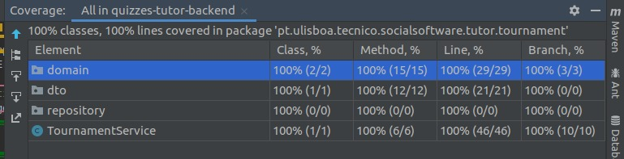

# ES20 P1 submission, Group NN

## Feature PPA

### Subgroup
 - Daniel Serafim, ist189428, dserafim1999
   + Issues assigned: [#7](https://github.com/tecnico-softeng/es20al_18-project/issues/7), [#16](https://github.com/tecnico-softeng/es20al_18-project/issues/16), [#17](https://github.com/tecnico-softeng/es20al_18-project/issues/17), [#19](https://github.com/tecnico-softeng/es20al_18-project/issues/19), [#29](https://github.com/tecnico-softeng/es20al_18-project/issues/29), [#45](https://github.com/tecnico-softeng/es20al_18-project/issues/45), [#46](https://github.com/tecnico-softeng/es20al_18-project/issues/46), [#47](https://github.com/tecnico-softeng/es20al_18-project/issues/47), [#49](https://github.com/tecnico-softeng/es20al_18-project/issues/49) [#61](https://github.com/tecnico-softeng/es20al_18-project/issues/61)
 - Tomás Inácio, ist189553, tomas1999set
   + Issues assigned: [#18](https://github.com/tecnico-softeng/es20al_18-project/issues/18), [#](https://github.com/tecnico-softeng/es20al_18-project/issues/), [#30](https://github.com/tecnico-softeng/es20al_18-project/issues/30), [#43](https://github.com/tecnico-softeng/es20al_18-project/issues/43), [#48](https://github.com/tecnico-softeng/es20al_18-project/issues/48), [#60](https://github.com/tecnico-softeng/es20al_18-project/issues/60)
 
### Pull requests associated with this feature

The list of pull requests associated with this feature is:

 - [PR #020](https://github.com/tecnico-softeng/es20al_18-project/pull/20)
 - [PR #032](https://github.com/tecnico-softeng/es20al_18-project/pull/32)
 - [PR #062](https://github.com/tecnico-softeng/es20al_18-project/pull/62)

### New/Updated domain entities

#### New entities
 - [Submission.java]()
 - [SubmissionDto.java]()
 - [SubmissionRepository.java]()
 - [SubmissionService.java]()
 - [Review.java]()
 - [ReviewDto.java]()
 - [ReviewRepository.java]()
 - [ReviewService.java]()

 - [CreateSubmissionTest.groovy]()
 - [CreateReviewTest.groovy]()
 - [GetSubmissionStatus.groovy]()

#### Entities changed
 - [ErrorMessage.java](https://github.com/tecnico-softeng/es20al_18-project/blob/develop/backend/src/main/java/pt/ulisboa/tecnico/socialsoftware/tutor/exceptions/ErrorMessage.java)
   + Added field `SUBMISSION_NOT_FOUND`
   + Added field `REVIEW_MISSING_JUSTIFICATION`
   + Added field `REVIEW_MISSING_SUBMISSION`
   + Added field `REVIEW_MISSING_STUDENT`
   + Added field `REVIEW_MISSING_STATUS`
   + Added field `SUBMISSION_MISSING_QUESTION`
   + Added field `SUBMISSION_MISSING_STUDENT`
   + Added field `USER_NOT_STUDENT`
   + Added field `USER_NOT_TEACHER`

 - [Image.java](https://github.com/tecnico-softeng/es20al_18-project/blob/develop/backend/src/main/java/pt/ulisboa/tecnico/socialsoftware/tutor/question/domain/Image.java)
   + Added field `review`

 - [User.java](https://github.com/tecnico-softeng/es20al_18-project/blob/develop/backend/src/main/java/pt/ulisboa/tecnico/socialsoftware/tutor/user/User.java)
   + Added field `submissions` 
   + Added field `reviews` 

### Feature testing

We define one success test, one insuccess test, and tests for invalid input. The direct links to these are:

 - [CreateSubmissionTest.groovy])
    + [Success test #0]()
    + [Insuccess test #0]()
    + [Tests for invalid input]()
- [CreateReviewTest.groovy])
    + [Success test #0]()
    + [Insuccess test #0]()
    + [Tests for invalid input]()
- [GetSubmissionStatusTest.groovy])
    + [Success test #0]()
    + [Success test #0]()
    + [Success test #0]()
    + [Success test #0]()

### Test Coverage Screenshot

The screenshot includes the test coverage results associated with the new/changed entities:

---

## Feature DDP

### Subgroup
 - Nome, istID, githubID
   + Issues assigned: [#1](https://github.com), [#3](https://github.com)
 - Nome, istID, githubID
   + Issues assigned: [#2](https://github.com), [#4](https://github.com)
 
### Pull requests associated with this feature

The list of pull requests associated with this feature is:

 - [PR #000](https://github.com)
 - [PR #001](https://github.com)
 - [PR #002](https://github.com)

### New/Updated domain entities

#### New entities
 - [EntityName0](https://github.com)
 - [EntityName1](https://github.com)

#### Entities changed
 - [EntityName2](https://github.com)
   + Added field `fieldName1`
   + Added field `fieldName2`
 
### Feature testing

We define one success tests one insuccess test, and tests for invalid input. The direct links to these are:

 - [CreateExternalCourseExecutionServiceSpockTest.groovy](https://github.com/socialsoftware/quizzes-tutor/blob/31ba9bd5f5ddcbab61f1c4b2daca7331ad099f98/backend/src/test/groovy/pt/ulisboa/tecnico/socialsoftware/tutor/administration/service/CreateExternalCourseExecutionServiceSpockTest.groovy)
    + [Success test #0](https://github.com/socialsoftware/quizzes-tutor/blob/31ba9bd5f5ddcbab61f1c4b2daca7331ad099f98/backend/src/test/groovy/pt/ulisboa/tecnico/socialsoftware/tutor/administration/service/CreateExternalCourseExecutionServiceSpockTest.groovy#L39)
    + [Insuccess test #0](https://github.com/socialsoftware/quizzes-tutor/blob/31ba9bd5f5ddcbab61f1c4b2daca7331ad099f98/backend/src/test/groovy/pt/ulisboa/tecnico/socialsoftware/tutor/administration/service/CreateExternalCourseExecutionServiceSpockTest.groovy#L104)
    + [Tests for invalid input](https://github.com/socialsoftware/quizzes-tutor/blob/31ba9bd5f5ddcbab61f1c4b2daca7331ad099f98/backend/src/test/groovy/pt/ulisboa/tecnico/socialsoftware/tutor/administration/service/CreateExternalCourseExecutionServiceSpockTest.groovy#L145)

### Test Coverage Screenshot

The screenshot includes the test coverage results associated with the new/changed entities:

---

## Feature TDP

### Subgroup
 - João Dinis, ist189485, JDinis99
   + Issues assigned: [#1](https://github.com/tecnico-softeng/es20al_18-project/issues/1), [#4](https://github.com/tecnico-softeng/es20al_18-project/issues/4), [#13](https://github.com/tecnico-softeng/es20al_18-project/issues/13), [#14](https://github.com/tecnico-softeng/es20al_18-project/issues/14)
 - Tiago Fonseca, ist189542, TiagoFonseca99
   + Issues assigned: [#24](https://github.com/tecnico-softeng/es20al_18-project/issues/14), [#25](https://github.com/tecnico-softeng/es20al_18-project/issues/25), [#27](https://github.com/tecnico-softeng/es20al_18-project/issues/27), [#28](https://github.com/tecnico-softeng/es20al_18-project/issues/28), [#34](https://github.com/tecnico-softeng/es20al_18-project/issues/34), [#36](https://github.com/tecnico-softeng/es20al_18-project/issues/36), [#37](https://github.com/tecnico-softeng/es20al_18-project/issues/37), [#39](https://github.com/tecnico-softeng/es20al_18-project/issues/39)
 
### Pull requests associated with this feature

The list of pull requests associated with this feature is:

 - [PR #021](https://github.com/tecnico-softeng/es20al_18-project/pull/21)
 - [PR #035](https://github.com/tecnico-softeng/es20al_18-project/pull/35)
 - [PR #038](https://github.com/tecnico-softeng/es20al_18-project/pull/38)
 - [PR #054](https://github.com/tecnico-softeng/es20al_18-project/pull/54)

### New/Updated domain entities

#### New entities
 - [TournamentService.java](https://github.com/tecnico-softeng/es20al_18-project/blob/develop/backend/src/main/java/pt/ulisboa/tecnico/socialsoftware/tutor/tournament/TournamentService.java)
 - [Tournament.java](https://github.com/tecnico-softeng/es20al_18-project/blob/develop/backend/src/main/java/pt/ulisboa/tecnico/socialsoftware/tutor/tournament/domain/Tournament.java)
 - [TournamentDto.java](https://github.com/tecnico-softeng/es20al_18-project/blob/develop/backend/src/main/java/pt/ulisboa/tecnico/socialsoftware/tutor/tournament/dto/TournamentDto.java)
 - [TournamentRepository.java](https://github.com/tecnico-softeng/es20al_18-project/blob/develop/backend/src/main/java/pt/ulisboa/tecnico/socialsoftware/tutor/tournament/repository/TournamentRepository.java)

 - [CreateTournamentTest.groovy](https://github.com/tecnico-softeng/es20al_18-project/blob/develop/backend/src/test/groovy/pt/ulisboa/tecnico/socialsoftware/tutor/tournament/service/CreateTournamentTest.groovy)
 - [GetOpenedTournamentsTest.groovy](https://github.com/tecnico-softeng/es20al_18-project/blob/develop/backend/src/test/groovy/pt/ulisboa/tecnico/socialsoftware/tutor/tournament/service/GetOpenedTournamentsTest.groovy)
 - [StudentJoinTournamentTest.groovy](https://github.com/tecnico-softeng/es20al_18-project/blob/develop/backend/src/test/groovy/pt/ulisboa/tecnico/socialsoftware/tutor/tournament/service/StudentJoinTournamentTest.groovy)

#### Entities changed
 - [ErrorMessage.java](https://github.com/tecnico-softeng/es20al_18-project/blob/develop/backend/src/main/java/pt/ulisboa/tecnico/socialsoftware/tutor/exceptions/ErrorMessage.java)
   + Added field `DUPLICATE_TOURNAMENT_PARTICIPANT`
 
### Feature testing

We define multiple success test, multiple insuccess test, and tests for invalid input. The direct links to these are:

 - [CreateTournamentTest.groovy](https://github.com/tecnico-softeng/es20al_18-project/blob/develop/backend/src/test/groovy/pt/ulisboa/tecnico/socialsoftware/tutor/tournament/service/CreateTournamentTest.groovy)
    + [Success test #1](https://github.com/tecnico-softeng/es20al_18-project/blob/develop/backend/src/test/groovy/pt/ulisboa/tecnico/socialsoftware/tutor/tournament/service/CreateTournamentTest.groovy#L80)
    + [Success test #2](https://github.com/tecnico-softeng/es20al_18-project/blob/develop/backend/src/test/groovy/pt/ulisboa/tecnico/socialsoftware/tutor/tournament/service/CreateTournamentTest.groovy#L175)
    + [Success test #3](https://github.com/tecnico-softeng/es20al_18-project/blob/develop/backend/src/test/groovy/pt/ulisboa/tecnico/socialsoftware/tutor/tournament/service/CreateTournamentTest.groovy#L219)
    + [Insuccess test #1](https://github.com/tecnico-softeng/es20al_18-project/blob/develop/backend/src/test/groovy/pt/ulisboa/tecnico/socialsoftware/tutor/tournament/service/CreateTournamentTest.groovy#L103)
    + [Insuccess test #2](https://github.com/tecnico-softeng/es20al_18-project/blob/develop/backend/src/test/groovy/pt/ulisboa/tecnico/socialsoftware/tutor/tournament/service/CreateTournamentTest.groovy#L199)
    + [Insuccess test #3](https://github.com/tecnico-softeng/es20al_18-project/blob/develop/backend/src/test/groovy/pt/ulisboa/tecnico/socialsoftware/tutor/tournament/service/CreateTournamentTest.groovy#L237)
    + [Insuccess test #4](https://github.com/tecnico-softeng/es20al_18-project/blob/develop/backend/src/test/groovy/pt/ulisboa/tecnico/socialsoftware/tutor/tournament/service/CreateTournamentTest.groovy#L263)
    + [Invalid Input test #1](https://github.com/tecnico-softeng/es20al_18-project/blob/develop/backend/src/test/groovy/pt/ulisboa/tecnico/socialsoftware/tutor/tournament/service/CreateTournamentTest.groovy#L123)
    + [Invalid Input test #2](https://github.com/tecnico-softeng/es20al_18-project/blob/develop/backend/src/test/groovy/pt/ulisboa/tecnico/socialsoftware/tutor/tournament/service/CreateTournamentTest.groovy#L140)
    + [Invalid Input test #3](https://github.com/tecnico-softeng/es20al_18-project/blob/develop/backend/src/test/groovy/pt/ulisboa/tecnico/socialsoftware/tutor/tournament/service/CreateTournamentTest.groovy#L157)
    + [Invalid Input test #4](https://github.com/tecnico-softeng/es20al_18-project/blob/develop/backend/src/test/groovy/pt/ulisboa/tecnico/socialsoftware/tutor/tournament/service/CreateTournamentTest.groovy#L284)
    + [Invalid Input test #5](https://github.com/tecnico-softeng/es20al_18-project/blob/develop/backend/src/test/groovy/pt/ulisboa/tecnico/socialsoftware/tutor/tournament/service/CreateTournamentTest.groovy#L301)

 - [GetOpenedTournamentsTest.groovy](https://github.com/tecnico-softeng/es20al_18-project/blob/develop/backend/src/test/groovy/pt/ulisboa/tecnico/socialsoftware/tutor/tournament/service/GetOpenedTournamentsTest.groovy)
    + [Success test #1](https://github.com/tecnico-softeng/es20al_18-project/blob/develop/backend/src/test/groovy/pt/ulisboa/tecnico/socialsoftware/tutor/tournament/service/GetOpenedTournamentsTest.groovy#L89)
    + [Success test #2](https://github.com/tecnico-softeng/es20al_18-project/blob/develop/backend/src/test/groovy/pt/ulisboa/tecnico/socialsoftware/tutor/tournament/service/GetOpenedTournamentsTest.groovy#L131)
    + [Success test #3](https://github.com/tecnico-softeng/es20al_18-project/blob/develop/backend/src/test/groovy/pt/ulisboa/tecnico/socialsoftware/tutor/tournament/service/GetOpenedTournamentsTest.groovy#L181)
    + [Success test #4](https://github.com/tecnico-softeng/es20al_18-project/blob/develop/backend/src/test/groovy/pt/ulisboa/tecnico/socialsoftware/tutor/tournament/service/GetOpenedTournamentsTest.groovy#L230)
    + [Success test #5](https://github.com/tecnico-softeng/es20al_18-project/blob/develop/backend/src/test/groovy/pt/ulisboa/tecnico/socialsoftware/tutor/tournament/service/GetOpenedTournamentsTest.groovy#L240)
    + [Success test #6](https://github.com/tecnico-softeng/es20al_18-project/blob/develop/backend/src/test/groovy/pt/ulisboa/tecnico/socialsoftware/tutor/tournament/service/GetOpenedTournamentsTest.groovy#L256)

 - [StudentJoinTournamentTest.groovy](https://github.com/tecnico-softeng/es20al_18-project/blob/develop/backend/src/test/groovy/pt/ulisboa/tecnico/socialsoftware/tutor/tournament/service/StudentJoinTournamentTest.groovy)
    + [Success test #1](https://github.com/tecnico-softeng/es20al_18-project/blob/develop/backend/src/test/groovy/pt/ulisboa/tecnico/socialsoftware/tutor/tournament/service/StudentJoinTournamentTest.groovy#L102)
    + [Insuccess test #1](https://github.com/tecnico-softeng/es20al_18-project/blob/develop/backend/src/test/groovy/pt/ulisboa/tecnico/socialsoftware/tutor/tournament/service/StudentJoinTournamentTest.groovy#L132)
    + [Insuccess test #2](https://github.com/tecnico-softeng/es20al_18-project/blob/develop/backend/src/test/groovy/pt/ulisboa/tecnico/socialsoftware/tutor/tournament/service/StudentJoinTournamentTest.groovy#L169)
    + [Insuccess test #3](https://github.com/tecnico-softeng/es20al_18-project/blob/develop/backend/src/test/groovy/pt/ulisboa/tecnico/socialsoftware/tutor/tournament/service/StudentJoinTournamentTest.groovy#L208)
    + [Insuccess test #4](https://github.com/tecnico-softeng/es20al_18-project/blob/develop/backend/src/test/groovy/pt/ulisboa/tecnico/socialsoftware/tutor/tournament/service/StudentJoinTournamentTest.groovy#L224)
    + [Insuccess test #5](https://github.com/tecnico-softeng/es20al_18-project/blob/develop/backend/src/test/groovy/pt/ulisboa/tecnico/socialsoftware/tutor/tournament/service/StudentJoinTournamentTest.groovy#L240)
    + [Insuccess test #6](https://github.com/tecnico-softeng/es20al_18-project/blob/develop/backend/src/test/groovy/pt/ulisboa/tecnico/socialsoftware/tutor/tournament/service/StudentJoinTournamentTest.groovy#L265)
    + [Insuccess test #7](https://github.com/tecnico-softeng/es20al_18-project/blob/develop/backend/src/test/groovy/pt/ulisboa/tecnico/socialsoftware/tutor/tournament/service/StudentJoinTournamentTest.groovy#L290)
    + [Insuccess test #8](https://github.com/tecnico-softeng/es20al_18-project/blob/develop/backend/src/test/groovy/pt/ulisboa/tecnico/socialsoftware/tutor/tournament/service/StudentJoinTournamentTest.groovy#L316)
    + [Invalid Input test](https://github.com/tecnico-softeng/es20al_18-project/blob/develop/backend/src/test/groovy/pt/ulisboa/tecnico/socialsoftware/tutor/tournament/service/StudentJoinTournamentTest.groovy#L341)

### Test Coverage Screenshot

The screenshot includes the test coverage results associated with the new/changed entities:

