# ES20 P2 submission, Group NN

## Feature PPA

### Subgroup
 - Nome, istID, githubID
   + Issues assigned: [#1](https://github.com), [#3](https://github.com)
 - Nome, istID, githubID
   + Issues assigned: [#2](https://github.com), [#4](https://github.com)
 
### Pull requests associated with this feature

The list of pull requests associated with this feature is:

 - [PR #000](https://github.com)
 - [PR #001](https://github.com)
 - [PR #002](https://github.com)

### Web services definition

#### Controllers
 - [Controller0](https://github.com)
 - [Controller1](https://github.com)

### Feature testing

Each subgroup member defined one reading test and one writing test. The direct links to these are:

 - [ReadingTestJMeter](https://github.com)
 - [WritingTestJMeter](https://github.com)

#### Screenshots of Results Trees and DB cleanup

### Load testing

Each subgroup member defined one reading test and one writing test. The direct links to these are:

 - [ReadingTestJMeter](https://github.com)
 - [WritingTestJMeter](https://github.com)

#### Screenshots of Summary Reports and DB cleanup

### Service profiling

We used the [Async Profiler](https://www.jetbrains.com/help/idea/async-profiler.html).

#### Screenshots of summary reports

#### Discussion of findings

**TODO**: include here a short description of findings (max. 3 sentences). If
you found opportunities for optimization, you can use more than 3 sentences to
describe what you found and how you optimized your code.

---

## Feature DDP

### Subgroup
 - Nome, istID, githubID
   + Issues assigned: [#1](https://github.com), [#3](https://github.com)
 - Nome, istID, githubID
   + Issues assigned: [#2](https://github.com), [#4](https://github.com)
 
### Pull requests associated with this feature

The list of pull requests associated with this feature is:

 - [PR #000](https://github.com)
 - [PR #001](https://github.com)
 - [PR #002](https://github.com)

### Web services definition

#### Controllers
 - [Controller0](https://github.com)
 - [Controller1](https://github.com)

### Feature testing

Each subgroup member defined one reading test and one writing test. The direct links to these are:

 - [ReadingTestJMeter](https://github.com)
 - [WritingTestJMeter](https://github.com)

#### Screenshots of Results Trees and DB cleanup

### Load testing

Each subgroup member defined one reading test and one writing test. The direct links to these are:

 - [ReadingTestJMeter](https://github.com)
 - [WritingTestJMeter](https://github.com)

#### Screenshots of Summary Reports and DB cleanup

### Service profiling

We used the [Async Profiler](https://www.jetbrains.com/help/idea/async-profiler.html).

#### Screenshots of summary reports

#### Discussion of findings

**TODO**: include here a short description of findings (max. 3 sentences). If
you found opportunities for optimization, you can use more than 3 sentences to
describe what you found and how you optimized your code.

---

## Feature TDP

### Subgroup
 - João Dinsi, ist189485, JDinis99
   + Issues assigned: [#1](https://github.com), [#3](https://github.com)
 - Nome, istID, githubID
   + Issues assigned: [#2](https://github.com), [#4](https://github.com)
 
### Pull requests associated with this feature

The list of pull requests associated with this feature is:

 - [PR #106](https://github.com/tecnico-softeng/es20al_18-project/pull/106)

### Web services definition

#### Controllers
 - [TournamentController](https://github.com/tecnico-softeng/es20al_18-project/blob/ea0b51deb2620f538367150fe2869e8dff3543de/backend/src/main/java/pt/ulisboa/tecnico/socialsoftware/tutor/tournament/TournamentController.java)

### Feature testing

Each subgroup member defined one reading test and one writing test. The direct links to these are:

 - [GetTournamentTest](https://github.com/tecnico-softeng/es20al_18-project/blob/ea0b51deb2620f538367150fe2869e8dff3543de/backend/jmeter/tournament/WSGetTournamentsTest.jmx)
 - [CreateTournamentTest](https://github.com/tecnico-softeng/es20al_18-project/blob/ea0b51deb2620f538367150fe2869e8dff3543de/backend/jmeter/tournament/WSCreateTournamentTest.jmx)
 
 - [GetOpenTournamentTest](https://github.com/tecnico-softeng/es20al_18-project/blob/ea0b51deb2620f538367150fe2869e8dff3543de/backend/jmeter/tournament/WSGetOpenTournamentsTest.jmx)

 - [GetTournamentParticipantsTest](https://github.com/tecnico-softeng/es20al_18-project/blob/ea0b51deb2620f538367150fe2869e8dff3543de/backend/jmeter/tournament/WSGetTournamentParticipants.jmx)
 - [JoinTournamentTest](https://github.com/tecnico-softeng/es20al_18-project/blob/ea0b51deb2620f538367150fe2869e8dff3543de/backend/jmeter/tournament/WSJoinTournamentTest.jmx)

#### Screenshots of Results Trees and DB cleanup

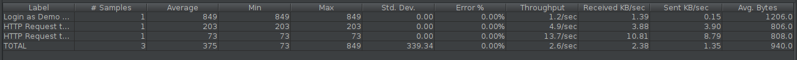
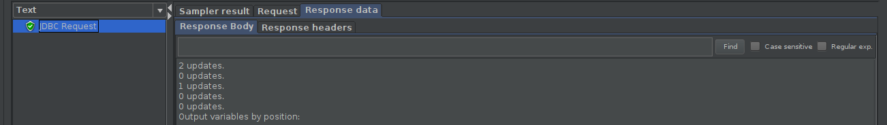

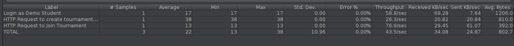
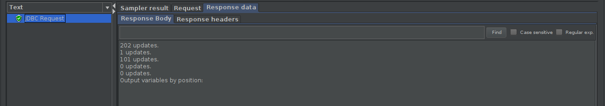

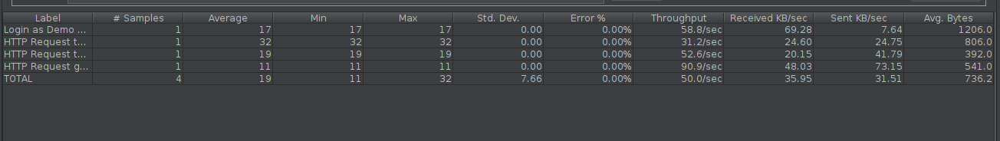

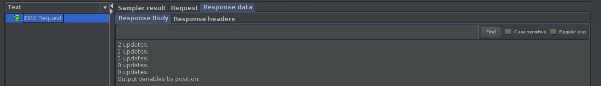

### Load testing

Each subgroup member defined one reading test and one writing test. The direct links to these are:

 - [GetTournamentLoadTest](https://github.com/tecnico-softeng/es20al_18-project/blob/ea0b51deb2620f538367150fe2869e8dff3543de/backend/jmeter/tournament/WSGetTournamentsLoadTest.jmx)
 - [CreateTournamentLoadTest](https://github.com/tecnico-softeng/es20al_18-project/blob/ea0b51deb2620f538367150fe2869e8dff3543de/backend/jmeter/tournament/WSCreateTournamentLoadTest.jmx)
 
 - [GetOpenTournamentLoadTest](https://github.com/tecnico-softeng/es20al_18-project/blob/ea0b51deb2620f538367150fe2869e8dff3543de/backend/jmeter/tournament/WSGetOpenTournamentsLoadTest.jmx)

 - [GetTournamentParticipantsLoadTest](https://github.com/tecnico-softeng/es20al_18-project/blob/ea0b51deb2620f538367150fe2869e8dff3543de/backend/jmeter/tournament/WSGetTournamentParticipantsLoadTest.jmx)
 - [JoinTournamentLoadTest](https://github.com/tecnico-softeng/es20al_18-project/blob/ea0b51deb2620f538367150fe2869e8dff3543de/backend/jmeter/tournament/WSJoinTournamentLoadTest.jmx)

#### Screenshots of Summary Reports and DB cleanup

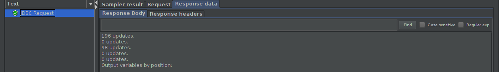

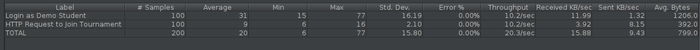
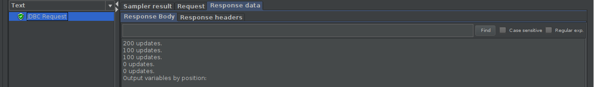

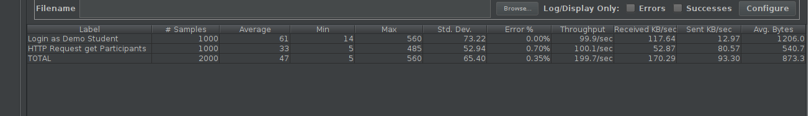

### Service profiling

We used the [Async Profiler](https://www.jetbrains.com/help/idea/async-profiler.html).

#### Screenshots of summary reports

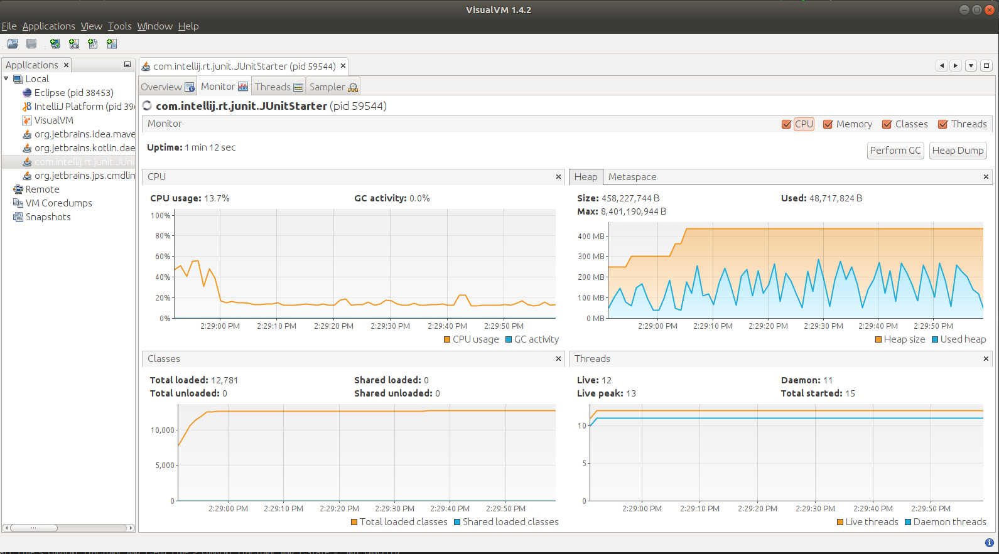
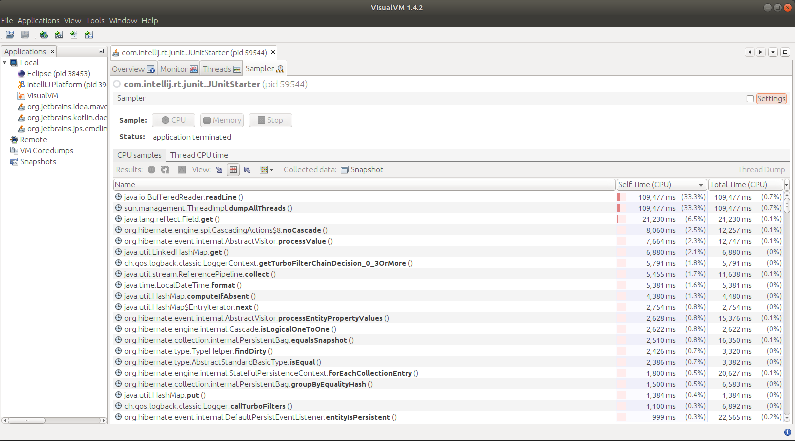
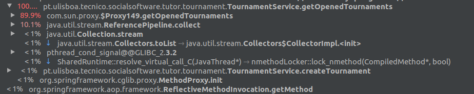

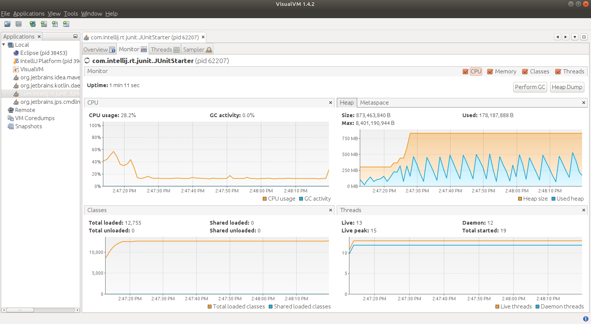

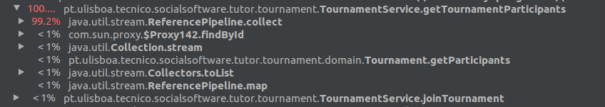

#### Discussion of findings

**TODO**: include here a short description of findings (max. 3 sentences). If
you found opportunities for optimization, you can use more than 3 sentences to
describe what you found and how you optimized your code.

