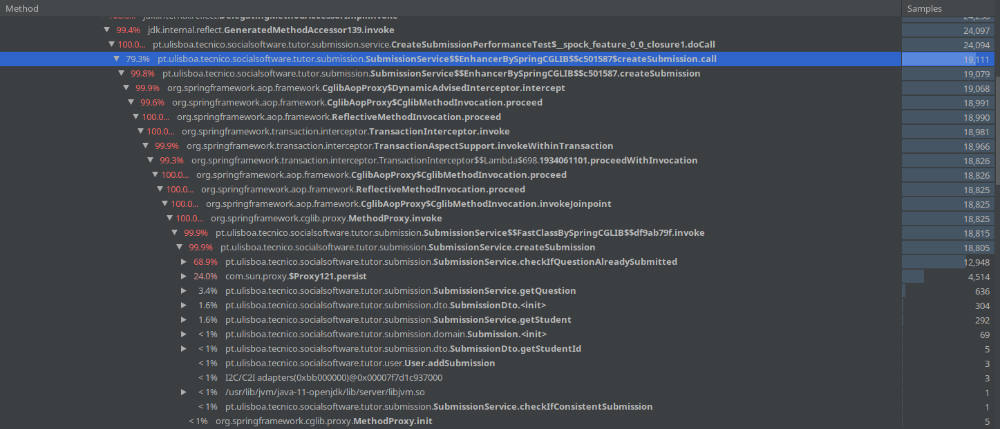
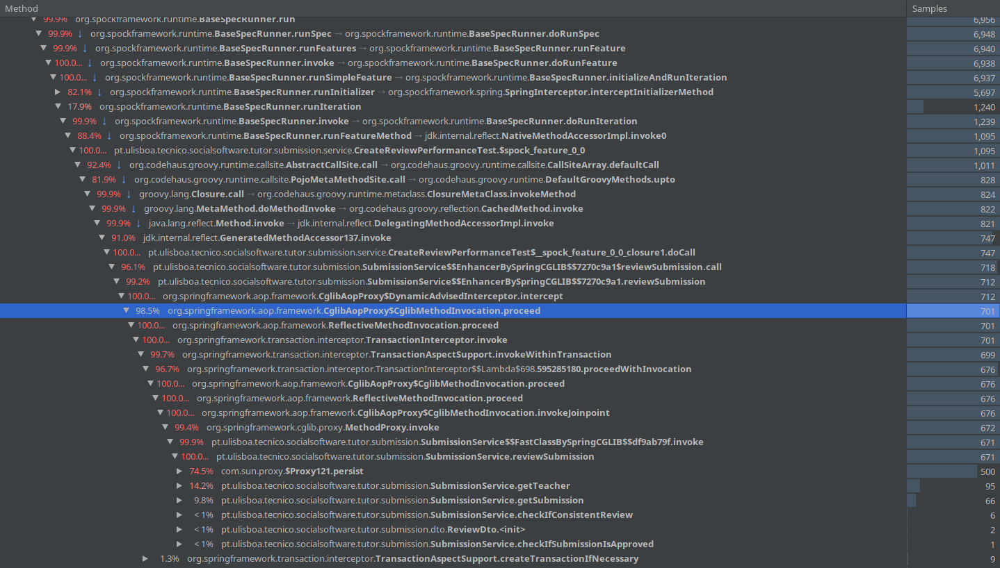
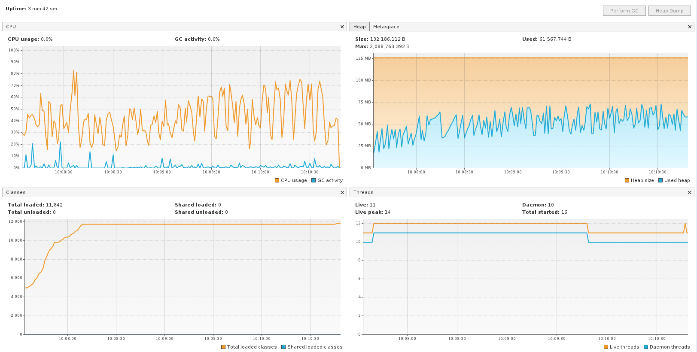
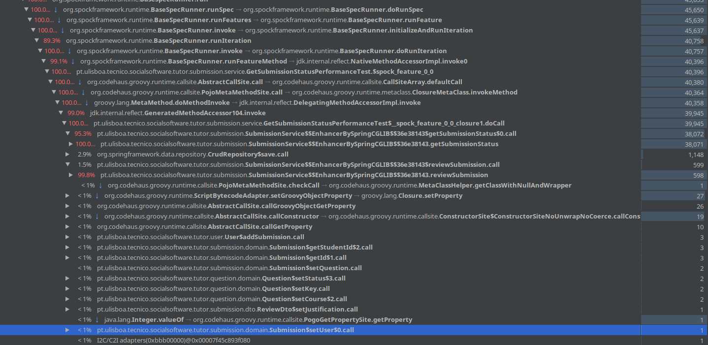
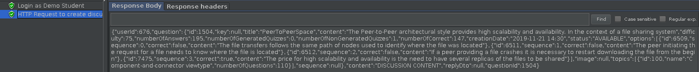
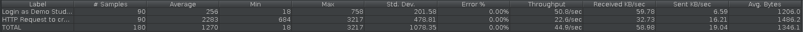
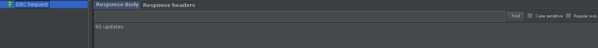

# ES20 P2 submission, Group 18

## Feature PPA

### Subgroup
 - Daniel Serafim, ist189428, dserafim1999
   + Issues assigned: [#88](https://github.com/tecnico-softeng/es20al_18-project/issues/88), [#90](https://github.com/tecnico-softeng/es20al_18-project/issues/90), [#91](https://github.com/tecnico-softeng/es20al_18-project/issues/91), [#92](https://github.com/tecnico-softeng/es20al_18-project/issues/92),
    [#95](https://github.com/tecnico-softeng/es20al_18-project/issues/95), [#96](https://github.com/tecnico-softeng/es20al_18-project/issues/96)
 - Tomás Inácio, ist189553, tomas1999set
   + Issues assigned: [#89](https://github.com/tecnico-softeng/es20al_18-project/issues/89), [#93](https://github.com/tecnico-softeng/es20al_18-project/issues/93), [#94](https://github.com/tecnico-softeng/es20al_18-project/issues/94)

### Pull requests associated with this feature

The list of pull requests associated with this feature is:

 - [PR #111](https://github.com/tecnico-softeng/es20al_18-project/pull/111)

### Web services definition

#### Controllers
 - [SubmissionController](https://github.com/tecnico-softeng/es20al_18-project/blob/43c30cade9f4ce5747629202746de8cac231d4e5/backend/src/main/java/pt/ulisboa/tecnico/socialsoftware/tutor/submission/SubmissionController.java)

### Feature testing

Each subgroup member defined one reading test and one writing test. The direct links to these are:

 - [CreateSubmissionTest](https://github.com/tecnico-softeng/es20al_18-project/blob/43c30cade9f4ce5747629202746de8cac231d4e5/backend/jmeter/submission/WSCreateSubmissionTest.jmx)
 - [CreateReviewSubmissionTest](https://github.com/tecnico-softeng/es20al_18-project/blob/43c30cade9f4ce5747629202746de8cac231d4e5/backend/jmeter/submission/WSCreateReviewSubmissionTest.jmx)
 - [GetSubmissionStatusTest](https://github.com/tecnico-softeng/es20al_18-project/blob/43c30cade9f4ce5747629202746de8cac231d4e5/backend/jmeter/submission/WSGetSubmissionStatusTest.jmx)

#### Screenshots of Results Trees and DB cleanup

##### Create Submission

##### Create Review

##### Get Submission Status

### Load testing

Each subgroup member defined one reading test and one writing test. The direct links to these are:

 - [CreateSubmissionLoadTest](https://github.com/tecnico-softeng/es20al_18-project/blob/43c30cade9f4ce5747629202746de8cac231d4e5/backend/jmeter/submission/WSCreateSubmissionLoadTest.jmx)
 - [CreateReviewSubmissionLoadTest](https://github.com/tecnico-softeng/es20al_18-project/blob/43c30cade9f4ce5747629202746de8cac231d4e5/backend/jmeter/submission/WSCreateReviewSubmissionLoadTest.jmx)
 - [GetSubmissionStatusLoadTest](https://github.com/tecnico-softeng/es20al_18-project/blob/43c30cade9f4ce5747629202746de8cac231d4e5/backend/jmeter/submission/WSGetSubmissionStatusLoadTest.jmx)

#### Screenshots of Summary Reports and DB cleanup

##### Create Submission

##### Create Review

##### Get SubmissionStatus

### Service profiling

We used the [Async Profiler](https://www.jetbrains.com/help/idea/async-profiler.html).

#### Screenshots of summary reports

##### Create Submission

##### Create Review

##### Get Submission Status

#### Discussion of findings

We concluded that searching for users and questions in the database took up most of the time when performing the tests, and therefore we thought best not to optimize our service.

---

## Feature DDP

### Subgroup
 - Daniel Matos, ist189429, DMaxter
   + Issues assigned: [#79](https://github.com/tecnico-softeng/es20al_18-project/issues/79), [#81](https://github.com/tecnico-softeng/es20al_18-project/issues/81), [#82](https://github.com/tecnico-softeng/es20al_18-project/issues/82), [#83](https://github.com/tecnico-softeng/es20al_18-project/issues/83), [#86](https://github.com/tecnico-softeng/es20al_18-project/issues/86), [#87](https://github.com/tecnico-softeng/es20al_18-project/issues/87)
 - João Paquete, ist189477, jpaquete14
   + Issues assigned: [#80](https://github.com/tecnico-softeng/es20al_18-project/issues/80), [#84](https://github.com/tecnico-softeng/es20al_18-project/issues/84), [#85](https://github.com/tecnico-softeng/es20al_18-project/issues/85)

### Pull requests associated with this feature

The list of pull requests associated with this feature is:

 - [PR #104](https://github.com/tecnico-softeng/es20al_18-project/pull/104)
 - [PR #107](https://github.com/tecnico-softeng/es20al_18-project/pull/107)

 - [PR #002](https://github.com)

### Web services definition

#### Controllers
 - [DiscussionController](https://github.com/tecnico-softeng/es20al_18-project/blob/7e4c202e9b95d6883976fdbe4c60c1b1ab232b94/backend/src/main/java/pt/ulisboa/tecnico/socialsoftware/tutor/discussion/api/DiscussionController.java)

### Feature testing

Each subgroup member defined one reading test and one writing test. The direct links to these are:

 - [CreateDiscussionTest](https://github.com/tecnico-softeng/es20al_18-project/blob/4ec2d3b03488b5de98ccc28ef3671c2971c15c44/backend/jmeter/discussion/WSCreateDiscussionTest.jmx)
 - [CreateReplyTest](https://github.com/tecnico-softeng/es20al_18-project/blob/1f31e61b57f0a9f0bacc82dffab06ceab2a612d6/backend/jmeter/discussion/WSCreateReplyTest.jmx)
 - [GetReplyTest](https://github.com/tecnico-softeng/es20al_18-project/blob/d25d4942e63ad4c5b459cb221e5ac3f949f102ab/backend/jmeter/discussion/WSGetReplyTest.jmx)

#### Screenshots of Results Trees and DB cleanup

##### Create Discussion

##### Create Reply

##### Get Reply

### Load testing

Each subgroup member defined one reading test and one writing test. The direct links to these are:

 - [CreateDiscussionLoadTest](https://github.com/tecnico-softeng/es20al_18-project/blob/4ec2d3b03488b5de98ccc28ef3671c2971c15c44/backend/jmeter/discussion/WSCreateDiscussionLoadTest.jmx)
 - [CreateReplyLoadTest](https://github.com/tecnico-softeng/es20al_18-project/blob/1f31e61b57f0a9f0bacc82dffab06ceab2a612d6/backend/jmeter/discussion/WSCreateReplyLoadTest.jmx)
 - [GetReplyLoadTest](https://github.com/tecnico-softeng/es20al_18-project/blob/d25d4942e63ad4c5b459cb221e5ac3f949f102ab/backend/jmeter/discussion/WSGetReplyLoadTest.jmx)

#### Screenshots of Summary Reports and DB cleanup

##### Create Discussion

##### Create Reply

##### Get Reply

### Service profiling

We used the [Async Profiler](https://www.jetbrains.com/help/idea/async-profiler.html).

#### Screenshots of summary reports

##### Create Discussion

##### Create Reply

##### Get Reply

#### Discussion of findings

By the analysis of the graphs of each test, we concluded that most of the time wasted in the tests was searching JPA for Questions and Users which is something that we can't optimize.

---

## Feature TDP

### Subgroup
 - João Dinis, ist189485, JDinis99
   + Issues assigned: [#75](https://github.com/tecnico-softeng/es20al_18-project/issues/75), [#76](https://github.com/tecnico-softeng/es20al_18-project/issues/76), [#77](https://github.com/tecnico-softeng/es20al_18-project/issues/77), [#78](https://github.com/tecnico-softeng/es20al_18-project/issues/78), [#100](https://github.com/tecnico-softeng/es20al_18-project/issues/100)
 - Tiago Fonseca, ist189542, TiagoFonseca99
   + Issues assigned: [#71](https://github.com/tecnico-softeng/es20al_18-project/issues/71), [#72](https://github.com/tecnico-softeng/es20al_18-project/issues/72), [#98](https://github.com/tecnico-softeng/es20al_18-project/issues/98), [#99](https://github.com/tecnico-softeng/es20al_18-project/issues/99), [#101](https://github.com/tecnico-softeng/es20al_18-project/issues/101), [#103](https://github.com/tecnico-softeng/es20al_18-project/issues/103)

### Pull requests associated with this feature

The list of pull requests associated with this feature is:

 - [PR #106](https://github.com/tecnico-softeng/es20al_18-project/pull/106)
 - [PR #108](https://github.com/tecnico-softeng/es20al_18-project/pull/108)

### Web services definition

#### Controllers
 - [TournamentController](https://github.com/tecnico-softeng/es20al_18-project/blob/a9551b8483852354412b376581d3d9f5e457df4e/backend/src/main/java/pt/ulisboa/tecnico/socialsoftware/tutor/tournament/TournamentController.java)

### Feature testing

Each subgroup member defined one reading test and one writing test. The direct links to these are:

 - [GetTournamentTest](https://github.com/tecnico-softeng/es20al_18-project/blob/a9551b8483852354412b376581d3d9f5e457df4e/backend/jmeter/tournament/WSGetTournamentsTest.jmx)
 - [CreateTournamentTest](https://github.com/tecnico-softeng/es20al_18-project/blob/a9551b8483852354412b376581d3d9f5e457df4e/backend/jmeter/tournament/WSCreateTournamentTest.jmx)

 - [GetOpenTournamentTest](https://github.com/tecnico-softeng/es20al_18-project/blob/a9551b8483852354412b376581d3d9f5e457df4e/backend/jmeter/tournament/WSGetOpenTournamentsTest.jmx)

 - [GetTournamentParticipantsTest](https://github.com/tecnico-softeng/es20al_18-project/blob/a9551b8483852354412b376581d3d9f5e457df4e/backend/jmeter/tournament/WSGetTournamentParticipants.jmx)
 - [JoinTournamentTest](https://github.com/tecnico-softeng/es20al_18-project/blob/a9551b8483852354412b376581d3d9f5e457df4e/backend/jmeter/tournament/WSJoinTournamentTest.jmx)

#### Screenshots of Results Trees and DB cleanup

##### GetTournaments

##### CreateTournament

##### GetOpenTournaments

##### GetTournamentParticipants

##### JoinTournament

### Load testing

Each subgroup member defined one reading test and one writing test. The direct links to these are:

 - [GetTournamentLoadTest](https://github.com/tecnico-softeng/es20al_18-project/blob/a9551b8483852354412b376581d3d9f5e457df4e/backend/jmeter/tournament/WSGetTournamentsLoadTest.jmx)
 - [CreateTournamentLoadTest](https://github.com/tecnico-softeng/es20al_18-project/blob/a9551b8483852354412b376581d3d9f5e457df4e/backend/jmeter/tournament/WSCreateTournamentLoadTest.jmx)

 - [GetOpenTournamentLoadTest](https://github.com/tecnico-softeng/es20al_18-project/blob/a9551b8483852354412b376581d3d9f5e457df4e/backend/jmeter/tournament/WSGetOpenTournamentsLoadTest.jmx)

 - [GetTournamentParticipantsLoadTest](https://github.com/tecnico-softeng/es20al_18-project/blob/a9551b8483852354412b376581d3d9f5e457df4e/backend/jmeter/tournament/WSGetTournamentParticipantsLoadTest.jmx)
 - [JoinTournamentLoadTest](https://github.com/tecnico-softeng/es20al_18-project/blob/a9551b8483852354412b376581d3d9f5e457df4e/backend/jmeter/tournament/WSJoinTournamentLoadTest.jmx)

#### Screenshots of Summary Reports and DB cleanup

##### GetTournaments

##### CreateTournament

##### GetOpenTournaments

##### GetTournamentParticipants

##### JoinTournament

### Service profiling

We used the [Async Profiler](https://www.jetbrains.com/help/idea/async-profiler.html).

#### Screenshots of summary reports

##### CreateTournament

##### GetOpenTournaments

##### JoinTournament

#### Discussion of findings

We decided to otimize the tournament class, allowing us to store the courseExecution of the tournament topics. 
Therefore we are avoiding unecessary searches everytime we need the courseExecution.
**Issue:** [#99](https://github.com/tecnico-softeng/es20al_18-project/issues/99)
