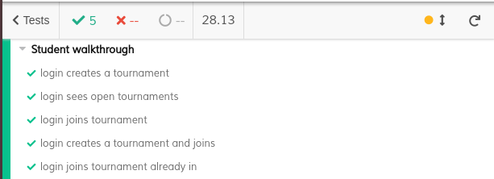

# ES20 P3 submission, Group 18

## Feature PPA

### Subgroup

 - Nome, istID, githubID
   + Issues assigned: [#1](https://github.com), [#3](https://github.com)
 - Nome, istID, githubID
   + Issues assigned: [#2](https://github.com), [#4](https://github.com)
 
### Pull requests associated with this feature

The list of pull requests associated with this feature is:

 - [PR #000](https://github.com)
 - [PR #001](https://github.com)
 - [PR #002](https://github.com)

### Frontend

#### New/Updated Views

 - [View0](https://github.com)
 - [View1](https://github.com)

#### New/Updated Models

 - [Model0](https://github.com)
 - [Model1](https://github.com)

### Additional services implemented

 - [Service 0](https://github.com)
    + [Controller](https://github.com)
    + [Spock tests](https://github.com)
    + [Feature test (JMeter)](https://github.com)

 - [Service 1](https://github.com)
    + [Controller](https://github.com)
    + [Spock tests](https://github.com)
    + [Feature test (JMeter)](https://github.com)

### End-to-end tests

#### Created tests

 - [Login creates and deletes a course execution](https://github.com/socialsoftware/quizzes-tutor/blob/6dcf668498be3d6e45c84ebf61e81b931bdc797b/frontend/tests/e2e/specs/admin/manageCourseExecutions.js#L10)
 - [Login creates two course executions and deletes it](https://github.com/socialsoftware/quizzes-tutor/blob/6dcf668498be3d6e45c84ebf61e81b931bdc797b/frontend/tests/e2e/specs/admin/manageCourseExecutions.js#L16)
 - [Login creates FROM a course execution and deletes it](https://github.com/socialsoftware/quizzes-tutor/blob/6dcf668498be3d6e45c84ebf61e81b931bdc797b/frontend/tests/e2e/specs/admin/manageCourseExecutions.js#L30)

#### Rationale
*TODO*: describe in 100 words (max) the relevance of the end-to-end tests defined with respect to the
common use cases.

#### Commands defined

 - [commands.js](https://github.com/socialsoftware/quizzes-tutor/blob/master/frontend/tests/e2e/support/commands.js)

#### Screenshot of test results overview

---

## Feature DDP

### Subgroup

 - Nome, istID, githubID
   + Issues assigned: [#1](https://github.com), [#3](https://github.com)
 - Nome, istID, githubID
   + Issues assigned: [#2](https://github.com), [#4](https://github.com)
 
### Pull requests associated with this feature

The list of pull requests associated with this feature is:

 - [PR #000](https://github.com)
 - [PR #001](https://github.com)
 - [PR #002](https://github.com)

### Frontend

#### New/Updated Views

 - [View0](https://github.com)
 - [View1](https://github.com)

#### New/Updated Models

 - [Model0](https://github.com)
 - [Model1](https://github.com)

### Additional services implemented

 - [Service 0](https://github.com)
    + [Controller](https://github.com)
    + [Spock tests](https://github.com)
    + [Feature test (JMeter)](https://github.com)

 - [Service 1](https://github.com)
    + [Controller](https://github.com)
    + [Spock tests](https://github.com)
    + [Feature test (JMeter)](https://github.com)

### End-to-end tests

#### Created tests

 - [Login creates and deletes a course execution](https://github.com/socialsoftware/quizzes-tutor/blob/6dcf668498be3d6e45c84ebf61e81b931bdc797b/frontend/tests/e2e/specs/admin/manageCourseExecutions.js#L10)
 - [Login creates two course executions and deletes it](https://github.com/socialsoftware/quizzes-tutor/blob/6dcf668498be3d6e45c84ebf61e81b931bdc797b/frontend/tests/e2e/specs/admin/manageCourseExecutions.js#L16)
 - [Login creates FROM a course execution and deletes it](https://github.com/socialsoftware/quizzes-tutor/blob/6dcf668498be3d6e45c84ebf61e81b931bdc797b/frontend/tests/e2e/specs/admin/manageCourseExecutions.js#L30)

#### Rationale
*TODO*: describe in 100 words (max) the relevance of the end-to-end tests defined with respect to the
common use cases.

#### Commands defined

 - [commands.js](https://github.com/socialsoftware/quizzes-tutor/blob/master/frontend/tests/e2e/support/commands.js)

#### Screenshot of test results overview

---

## Feature TDP

### Subgroup
 - João Dinis, ist189485, JDinis99
   + Issues assigned: [#113](https://github.com/tecnico-softeng/es20al_18-project/issues/113), [#136](https://github.com/tecnico-softeng/es20al_18-project/issues/136), [#137](https://github.com/tecnico-softeng/es20al_18-project/issues/137), [#138](https://github.com/tecnico-softeng/es20al_18-project/issues/138)
 - Tiago Fonseca, ist189542, TiagoFonseca99
   + Issues assigned: [#115](https://github.com/tecnico-softeng/es20al_18-project/issues/115), [#116](https://github.com/tecnico-softeng/es20al_18-project/issues/116), [#151](https://github.com/tecnico-softeng/es20al_18-project/issues/151), [#163](https://github.com/tecnico-softeng/es20al_18-project/issues/163), [#164](https://github.com/tecnico-softeng/es20al_18-project/issues/164)

### Pull requests associated with this feature

The list of pull requests associated with this feature is:

 - [PR #146](https://github.com/tecnico-softeng/es20al_18-project/pull/146)
 - [PR #155](https://github.com/tecnico-softeng/es20al_18-project/pull/155)
 - [PR #165](https://github.com/tecnico-softeng/es20al_18-project/pull/165)
 - [PR #168](https://github.com/tecnico-softeng/es20al_18-project/pull/168)

### Frontend

#### New/Updated Views

 - [AllTournamentView](https://github.com/tecnico-softeng/es20al_18-project/tree/0341cbb16b8ed157d365f8b105e47d7e7afa5059/frontend/src/views/student/tournament/AllTournamentView.vue)
 - [OpenTournamentView](https://github.com/tecnico-softeng/es20al_18-project/tree/0341cbb16b8ed157d365f8b105e47d7e7afa5059/frontend/src/views/student/tournament/OpenTournamentView.vue)
 - [EditTournamentView](https://github.com/tecnico-softeng/es20al_18-project/tree/0341cbb16b8ed157d365f8b105e47d7e7afa5059/frontend/src/views/student/tournament/EditTournamentView.vue)

#### New/Updated Models

 - [TournamentModel](https://github.com/tecnico-softeng/es20al_18-project/tree/0341cbb16b8ed157d365f8b105e47d7e7afa5059/frontend/src/models/user/Tournament.ts)

### Additional services implemented

No new services needed to be implemented

### End-to-end tests

#### Created tests

 - [Login creates a tournament](https://github.com/tecnico-softeng/es20al_18-project/blob/0341cbb16b8ed157d365f8b105e47d7e7afa5059/frontend/tests/e2e/specs/student/tournament.js#L17)
 - [Login sees open tournaments](https://github.com/tecnico-softeng/es20al_18-project/blob/0341cbb16b8ed157d365f8b105e47d7e7afa5059/frontend/tests/e2e/specs/student/tournament.js#L21)
 - [Login joins a tournament](https://github.com/tecnico-softeng/es20al_18-project/blob/0341cbb16b8ed157d365f8b105e47d7e7afa5059/frontend/tests/e2e/specs/student/tournament.js#L27)
 - [Login creates a tournament and joins](https://github.com/tecnico-softeng/es20al_18-project/blob/0341cbb16b8ed157d365f8b105e47d7e7afa5059/frontend/tests/e2e/specs/student/tournament.js#L31)
 - [Login joins a tournament already in](https://github.com/tecnico-softeng/es20al_18-project/blob/0341cbb16b8ed157d365f8b105e47d7e7afa5059/frontend/tests/e2e/specs/student/tournament.js#L37)

#### Rationale
The tests reflect how a user would use the program. By creating, seeing and joining tournaments.

#### Commands defined

 - [DemoStudentLogin](https://github.com/tecnico-softeng/es20al_18-project/blob/0341cbb16b8ed157d365f8b105e47d7e7afa5059/frontend/tests/e2e/support/commands.js#L27)
 - [CreateTournament](https://github.com/tecnico-softeng/es20al_18-project/blob/0341cbb16b8ed157d365f8b105e47d7e7afa5059/frontend/tests/e2e/support/commands.js#L62)
 - [Time](https://github.com/tecnico-softeng/es20al_18-project/blob/0341cbb16b8ed157d365f8b105e47d7e7afa5059/frontend/tests/e2e/support/commands.js#L73)
 - [SelectTopic](https://github.com/tecnico-softeng/es20al_18-project/blob/0341cbb16b8ed157d365f8b105e47d7e7afa5059/frontend/tests/e2e/support/commands.js#L113)
 - [JoinTournament](https://github.com/tecnico-softeng/es20al_18-project/blob/0341cbb16b8ed157d365f8b105e47d7e7afa5059/frontend/tests/e2e/support/commands.js#L128)

   
 
#### Screenshot of test results overview

